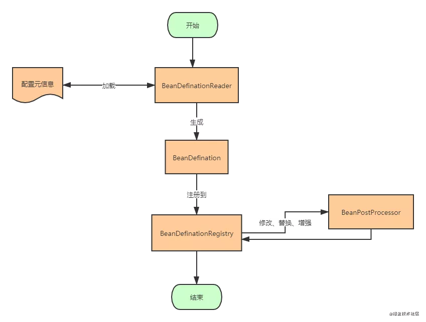
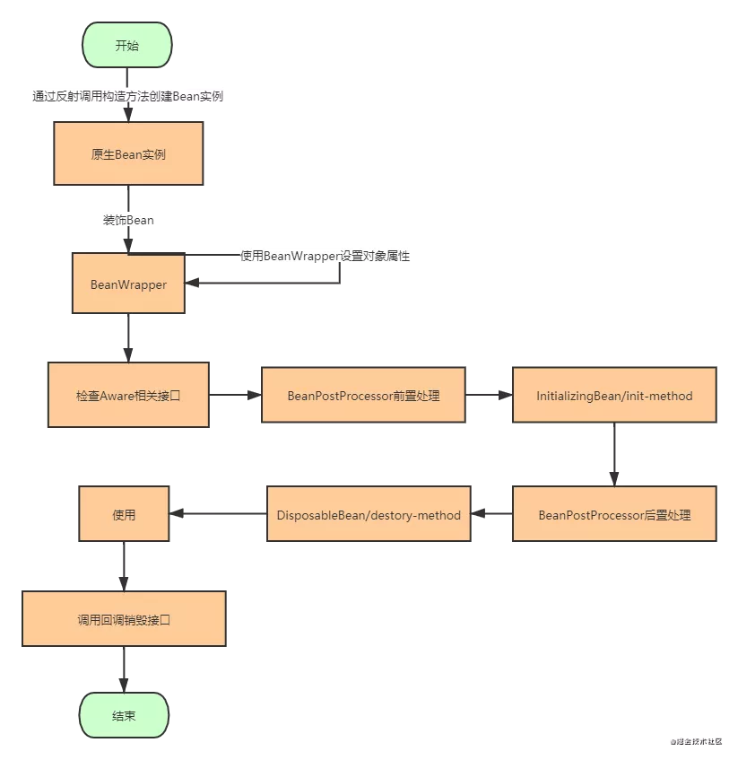
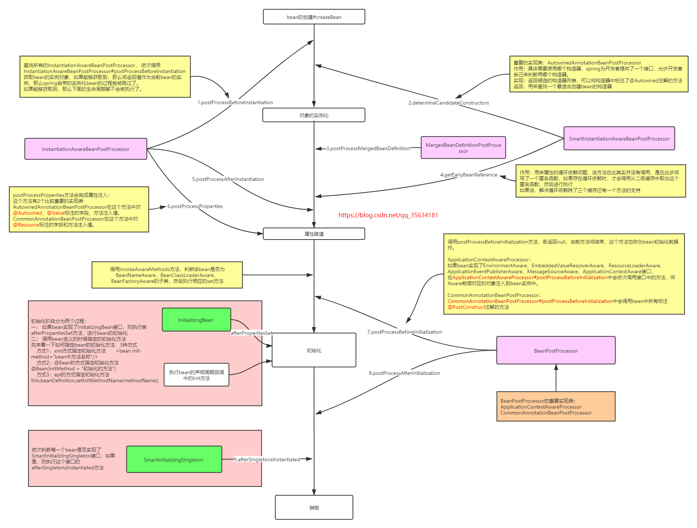

# Java相关点

# Java基础

# JVM

# 多线程

## [AQS](并发和多线程/AQS.md)

## [Future类](并发和多线程/Future类.md)

## [Synchronized](并发和多线程/synchronized解析.md)

## [ThreadLocal](并发和多线程/ThreadLocal.md)

## [原子类](并发和多线程/原子类.md)

## [并发工具类](并发和多线程/并发工具类(同步器).md)

## [线程池](并发和多线程/线程池.md)

## [多线程编程题](并发和多线程/多线程编程题.md)

# Spring相关

## 概述

Spring优点

- 方便解耦，简化开发 Spring就是一个大工厂，可以将所有对象的创建和依赖关系的维护交给Spring管理

- 方便集成各种框架 Spring可以整合很多框架，比如Mybatis

- 方便程序的测试 Spring支持JUnit4，可以通过注解很方便的测试Spring程序

- 支持AOP（面向切面编程） Spring提供了面向切面编程

- 声明式事务 只需要配置就可以完成对事务的管理，无需手动编程

## IOC

IOC是指在程序开发过程中，对象实例的创建不再由调用者管理，而是由Spring容器创建，Spring容器会负责控制程序之间的关系，而不是由代码直接控制，因此，控制权由程序代码转移到了Spring容器，控制权发生了反转，即控制反转。
Spring IOC提供了两种IOC容器，分别是BeanFactory和ApplicationContext。

**BeanFactory**

BeanFactory是基础的IOC容器，是一个接口，提供了完整的IOC服务，BeanFactory是一个管理Bean的工厂，他主要负责初始化各种bean，并调用它们的生命周期方法
BeanFactory接口有多个实现类，最常见的是XmlBeanFactory，它根据Xml配置文件中的定义装配Bean。

**ApplicationContext**

ApplicationContext是BeanFactory的字接口，也被称为应用上下文，不仅提供了BeanFactory的所有功能，还添加了对国际化、资源访问、事件传播等方面的支持。

**依赖注入**

依赖注入和控制反转含义相同，他们是从两个角度描述同一个概念。
当某个对象实例需要另外一个对象实例时，传统的方法是由调用者创建被调用者的实例，比如使用new，而使用Spring框架后，被调用者的实例不再有调用者创建，而是交给了Spring容器，者称为控制反转。
Spring容器在创建被调用实例时，会自动将调用者需要的对象实例注入为调用者，这样，通过  Spring容器获得被调用者实例，成为依赖注入。

**Spring中Bean的作用域**

- 在Spring配置文件中，使用的scope属性设置Bean的作用域

- singleton 单例模式，使用singleton定义的Bean在Spring容器中只有一个实例，这也是Bean的默认作用域，所有的Bean请求，只要id与该Bean定义相匹配，就只会返回Bean的同一个实例。适用于无回话状态的Bean，例如(DAO层、Service层)。

- prototype 原型模式，每次通过Spring容器获取prototype定义的Bean时，容器都会创建一个新的Bean实例，适用于需要需要保持会话状态的Bean(比如Struts2的Action类)。

- request 在一次HTTP请求中，容器会返回该Bean的同一个实例，而对于不同的HTTP请求，会返回不同的实例，该作用域仅在当前HttpRequest内有效

- session 在一次HttpSession中，容器会返回该Bean的同一个实例，而对于不同的HTTP请求，会返回不同的实例，该作用域仅在当前HttpSession内有效

- global Session 在一个全局的session中，容器会返回该Bean的同一个实例，该作用域仅在使用portlet context时有效。

## SpringBean的生命周期

- Spring容器可以管理singleton作用域Bean的生命周期，在此作用域下，Spring能够精确的知道该Bean何时被创建，何时初始化完成，以及何时被销毁。

- 而对于prototype作用域的Bean，Spring只负责创建，当容器创建了Bean的实例后，Bean的实例就交给客户端代码管理，Spring容器不再跟踪其生命周期，每次客户端请求prototype作用域的bean时，Spring容器都会创建一个新的Bean，并且不会管那些被配置成prototype作用域的Bean的生命周期。

Spring将管理的一个个的依赖对象称之为Bean，Spring IOC容器就好像一个生产产品的流水线上的机器，Spring创建出来的Bean就好像是流水线的终点生产出来的一个个精美绝伦的产品。既然是机器，总要先启动，Spring也不例外。因此Bean的一生从总体上来说可以分为两个阶段：

- 容器启动阶段

- Bean实例化阶段

### 容器启动阶段

#### 配置元信息

Spring IOC容器将对象实例的创建与对象实例的使用分离，我们的业务中需要依赖哪个对象不再依靠我们自己手动创建，只要向Spring要，Spring就会以注入的方式交给我们需要的依赖对象。

既然我们将对象创建的任务交给了Spring，那么Spring就需要知道创建一个对象所需要的一些必要的信息。而这些必要的信息可以是Spring过去支持最完善的xml配置文件，或者是其他形式的例如properties的磁盘文件，也可以是现在主流的注解，甚至是直接的代码硬编码。总之，这些创建对象所需要的必要信息称为配置元信息。

#### BeanDefinition

在Java世界中，万物皆对象，散落于程序代码各处的注解以及保存在磁盘上的xml或者其他文件等等配置元信息，在内存中总要以一种对象的形式表示，而Spring选择在内存中表示这些配置元信息的方式就是BeanDefinition。

#### BeanDefinitionReader

Spring是通过BeanDefinitionReader来读取这些配置元信息的。不同的BeanDefinitionReader就像葫芦兄弟一样，各自拥有各自的本领。如果我们要读取xml配置元信息，那么可以使用XmlBeanDefinitionReader。如果我们要读取properties配置文件，那么可以使用PropertiesBeanDefinitionReader加载。

总的来说，BeanDefinitionReader的作用就是加载配置元信息，并将其转化为内存形式的BeanDefinition。

#### BeanDefinitionRegistry

执行到这里，总算不遗余力的将存在于各处的配置元信息加载到内存，并转化为BeanDefinition的形式，这样我们需要创建某一个对象实例的时候，找到相应的BeanDefinition然后创建对象即可。那么我们需要某一个对象的时候，去哪里找到对应的BeanDefinition呢？

Spring通过BeanDefinitionReader将配置元信息加载到内存生成相应的BeanDefinition之后，就将其注册到BeanDefinitionRegistry中，BeanDefinitionRegistry就是一个存放BeanDefinition的大篮子，它也是一种键值对的形式，通过特定的Bean定义的id，映射到相应的BeanDefinition。

#### BeanFactoryPostProcessor

BeanFactoryPostProcessor是容器启动阶段Spring提供的一个扩展点，主要负责对注册到BeanDefinitionRegistry中的一个个的BeanDefinition进行一定程度上的修改与替换。

例如我们的配置元信息中有些可能会修改的配置信息散落到各处，不够灵活，修改相应配置的时候比较麻烦，这时我们可以使用占位符的方式来配置。

例如配置Jdbc的DataSource连接的时候可以这样配置:

```xml
<bean id="dataSource"  
    class="org.apache.commons.dbcp.BasicDataSource"  
    destroy-method="close">  
    <property name="maxIdle" value="${jdbc.maxIdle}"></property>  
    <property name="maxActive" value="${jdbc.maxActive}"></property>  
    <property name="maxWait" value="${jdbc.maxWait}"></property>  
    <property name="minIdle" value="${jdbc.minIdle}"></property>  
  
    <property name="driverClassName"  
        value="${jdbc.driverClassName}">  
    </property>  
    <property name="url" value="${jdbc.url}"></property>  
  
    <property name="username" value="${jdbc.username}"></property>  
    <property name="password" value="${jdbc.password}"></property>  
</bean> 
```

BeanFactoryPostProcessor就会对注册到BeanDefinitionRegistry中的BeanDefinition做最后的修改，替换$占位符为配置文件中的真实的数据。

至此，整个容器启动阶段就算完成了，容器的启动阶段的最终产物就是注册到BeanDefinitionRegistry中的一个个BeanDefinition了，这就是Spring为Bean实例化所做的预热的工作。让我们再通过一张图的形式回顾一下容器启动阶段都是搞了什么事吧。



### Bean实例化阶段

需要指出，容器启动阶段与Bean实例化阶段存在多少时间差，Spring把这个决定权交给了我们程序员。

如果我们选择懒加载的方式，那么直到我们伸手向Spring要依赖对象实例之前，其都是以BeanDefinitionRegistry中的一个个的BeanDefinition的形式存在，也就是Spring只有在我们需要依赖对象的时候才开启相应对象的实例化阶段。

而如果我们不是选择懒加载的方式，容器启动阶段完成之后，将立即启动Bean实例化阶段，通过隐式的调用所有依赖对象的getBean方法来实例化所有配置的Bean并保存起来。

#### 对象创建策略

对象的创建采用了策略模式，借助我们前面BeanDefinitionRegistry中的BeanDefinition,我们可以使用反射的方式创建对象，也可以使用CGlib字节码生成创建对象。

同时我们可以灵活的配置来告诉Spring采用什么样的策略创建指定的依赖对象。Spring中Bean的创建是策略设计模式的经典应用。这个时候，内存中应该已经有一个我们想要的具体的依赖对象的实例了。

#### BeanWrapper——对象的外衣

Spring中的Bean并不是以一个个的本来模样存在的，由于Spring IOC容器中要管理多种类型的对象，因此为了统一对不同类型对象的访问，Spring给所有创建的Bean实例穿上了一层外套，这个外套就是BeanWrapper。

BeanWrapper实际上是对反射相关API的简单封装，使得上层使用反射完成相关的业务逻辑大大的简化，我们要获取某个对象的属性，调用某个对象的方法，现在不需要在写繁杂的反射API了以及处理一堆麻烦的异常，直接通过BeanWrapper就可以完成相关操作。

#### 设置对象属性

对于基本类型的属性，如果配置元信息中有配置，那么将直接使用配置元信息中的设置值赋值即可，即使基本类型的属性没有设置值，那么得益于JVM对象实例化过程，属性依然可以被赋予默认的初始化零值。

对于引用类型的属性，Spring会将所有已经创建好的对象放入一个Map结构中，此时Spring会检查所依赖的对象是否已经被纳入容器的管理范围之内，也就是Map中是否已经有对应对象的实例了。如果有，那么直接注入，如果没有,那么Spring会暂时放下该对象的实例化过程，转而先去实例化依赖对象，再回过头来完成该对象的实例化过程。

**这里有一个Spring中的经典问题，那就是Spring是如何解决循环依赖的？**

这里简单提一下，Spring是通过三级缓存解决循环依赖，并且只能解决Setter注入的循环依赖。

#### 检查Aware相关接口

我们如果想要依赖Spring中的相关对象，使用Spring的相关API,那么可以实现相应的Aware接口，Spring IOC容器就会为我们自动注入相关依赖对象实例。

Spring IOC容器大体可以分为两种，BeanFactory提供IOC思想所设想所有的功能，同时也融入AOP等相关功能模块，可以说BeanFactory是Spring提供的一个基本的IOC容器。ApplicationContext构建于BeanFactory之上，同时提供了诸如容器内的时间发布、统一的资源加载策略、国际化的支持等功能，是Spring提供的更为高级的IOC容器。

对于BeanFactory来说，这一步的实现是先检查相关的Aware接口，然后去Spring的对象池(也就是容器，也就是那个Map结构)中去查找相关的实例(例如对于ApplicationContextAware接口，就去找ApplicationContext实例)，也就是说我们必须要在配置文件中或者使用注解的方式，将相关实例注册容器中，BeanFactory才可以为我们自动注入。

而对于ApplicationContext，由于其本身继承了一系列的相关接口，所以当检测到Aware相关接口，需要相关依赖对象的时候，ApplicationContext完全可以将自身注入到其中，ApplicationContext实现这一步是通过下面要讲到的东东——BeanPostProcessor。

#### BeanPostProcessor前置处理

BeanFactoryPostProcessor存在于容器启动阶段而BeanPostProcessor存在于对象实例化阶段，BeanFactoryPostProcessor关注对象被创建之前 那些配置的修修改改，缝缝补补，而BeanPostProcessor阶段关注对象已经被创建之后 的功能增强，替换等操作。

BeanPostProcessor与BeanFactoryPostProcessor都是Spring在Bean生产过程中强有力的扩展点。如果你还对它感到很陌生，那么你肯定知道Spring中著名的AOP(面向切面编程)，其实就是依赖BeanPostProcessor对Bean对象功能增强的。

BeanPostProcessor前置处理就是在要生产的Bean实例放到容器之前，允许我们程序员对Bean实例进行一定程度的修改，替换等操作。

前面讲到的ApplicationContext对于Aware接口的检查与自动注入就是通过BeanPostProcessor实现的，在这一步Spring将检查Bean中是否实现了相关的Aware接口，如果是的话，那么就将其自身注入Bean中即可。Spring中AOP就是在这一步实现的偷梁换柱，产生对于原生对象的代理对象，然后将对源对象上的方法调用，转而使用代理对象的相同方法调用实现的。

#### 自定义初始化逻辑

在所有的准备工作完成之后，如果我们的Bean还有一定的初始化逻辑，那么Spring将允许我们通过两种方式配置我们的初始化逻辑：

- InitializingBean

- 配置init-method参数

#### BeanPostProcess后置处理

与前置处理类似，这里是在Bean自定义逻辑也执行完成之后，Spring又留给我们的最后一个扩展点。我们可以在这里在做一些我们想要的扩展。

#### 自定义销毁逻辑

这一步对应自定义初始化逻辑，同样有两种方式：

- 实现DisposableBean接口

- 配置destroy-method参数。

这里一个比较典型的应用就是配置dataSource的时候destroy-method为数据库连接的close()方法。

我们再通过一张图来一起看一看Bean实例化阶段的执行顺序是如何的？



需要指出，容器启动阶段与Bean实例化阶段之间的桥梁就是我们可以选择自定义配置的延迟加载策略，如果我们配置了Bean的延迟加载策略，那么只有我们在真实的使用依赖对象的时候，Spring才会开始Bean的实例化阶段。

而如果我们没有开启Bean的延迟加载，那么在容器启动阶段之后，就会紧接着进入Bean实例化阶段，通过隐式的调用getBean方法，来实例化相关Bean。

这里贴一张更细的图，来源https://blog.csdn.net/qq_35634181/article/details/104473308



## AOP

## SpringBoot

### 自动装配

Spring的自动装配原理：

Spring Boot启动的时候会通过@EnableAutoConfiguration注解找到META-INF/spring.factories配置文件中的所有自动配置类，并对其进行加载，而这些自动配置类都是以AutoConfiguration结尾来命名的，它实际上就是一个JavaConfig形式的Spring容器配置类，它能通过以Properties结尾命名的类中取得在全局配置文件中配置的属性如：server.port，而XxxxProperties类是通过@ConfigurationProperties注解与全局配置文件中对应的属性进行绑定的。