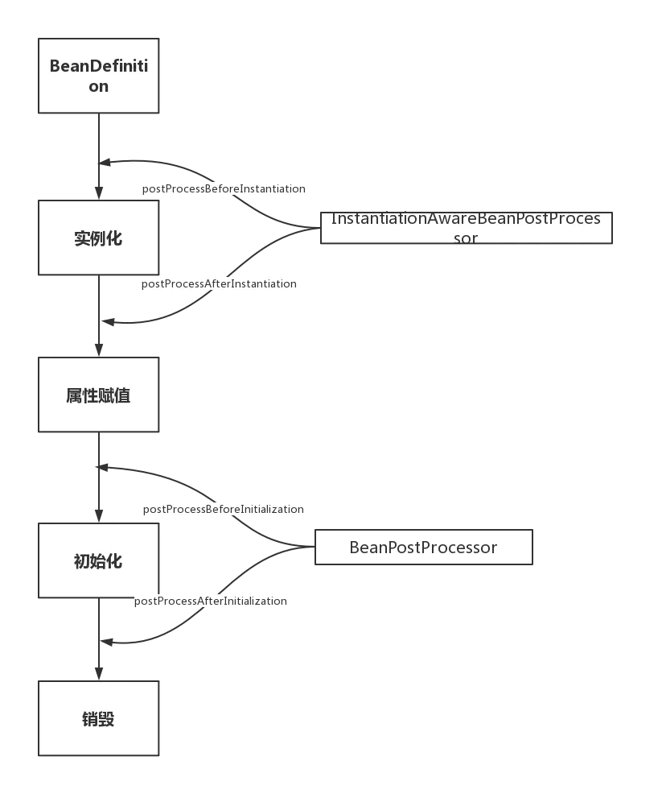

# Java相关点

# Java基础

# JVM

# 多线程

## [AQS](并发和多线程/AQS.md)

## [Future类](并发和多线程/Future类.md)

## [Synchronized](并发和多线程/synchronized解析.md)

## [ThreadLocal](并发和多线程/ThreadLocal.md)

## [原子类](并发和多线程/原子类.md)

## [并发工具类](并发和多线程/并发工具类(同步器).md)

## [线程池](并发和多线程/线程池.md)

## [多线程编程题](并发和多线程/多线程编程题.md)

# Spring相关

## 概述

Spring优点

- 方便解耦，简化开发 Spring就是一个大工厂，可以将所有对象的创建和依赖关系的维护交给Spring管理

- 方便集成各种框架 Spring可以整合很多框架，比如Mybatis

- 方便程序的测试 Spring支持JUnit4，可以通过注解很方便的测试Spring程序

- 支持AOP（面向切面编程） Spring提供了面向切面编程

- 声明式事务 只需要配置就可以完成对事务的管理，无需手动编程

## IOC

IOC是指在程序开发过程中，对象实例的创建不再由调用者管理，而是由Spring容器创建，Spring容器会负责控制程序之间的关系，而不是由代码直接控制，因此，控制权由程序代码转移到了Spring容器，控制权发生了反转，即控制反转。
Spring IOC提供了两种IOC容器，分别是BeanFactory和ApplicationContext。

**BeanFactory**

BeanFactory是基础的IOC容器，是一个接口，提供了完整的IOC服务，BeanFactory是一个管理Bean的工厂，他主要负责初始化各种bean，并调用它们的生命周期方法
BeanFactory接口有多个实现类，最常见的是XmlBeanFactory，它根据Xml配置文件中的定义装配Bean。

**ApplicationContext**

ApplicationContext是BeanFactory的字接口，也被称为应用上下文，不仅提供了BeanFactory的所有功能，还添加了对国际化、资源访问、事件传播等方面的支持。

**依赖注入**

依赖注入和控制反转含义相同，他们是从两个角度描述同一个概念。
当某个对象实例需要另外一个对象实例时，传统的方法是由调用者创建被调用者的实例，比如使用new，而使用Spring框架后，被调用者的实例不再有调用者创建，而是交给了Spring容器，者称为控制反转。
Spring容器在创建被调用实例时，会自动将调用者需要的对象实例注入为调用者，这样，通过  Spring容器获得被调用者实例，成为依赖注入。

**Spring中Bean的作用域**

- 在Spring配置文件中，使用的scope属性设置Bean的作用域

- singleton 单例模式，使用singleton定义的Bean在Spring容器中只有一个实例，这也是Bean的默认作用域，所有的Bean请求，只要id与该Bean定义相匹配，就只会返回Bean的同一个实例。适用于无回话状态的Bean，例如(DAO层、Service层)。

- prototype 原型模式，每次通过Spring容器获取prototype定义的Bean时，容器都会创建一个新的Bean实例，适用于需要需要保持会话状态的Bean(比如Struts2的Action类)。

- request 在一次HTTP请求中，容器会返回该Bean的同一个实例，而对于不同的HTTP请求，会返回不同的实例，该作用域仅在当前HttpRequest内有效

- session 在一次HttpSession中，容器会返回该Bean的同一个实例，而对于不同的HTTP请求，会返回不同的实例，该作用域仅在当前HttpSession内有效

- global Session 在一个全局的session中，容器会返回该Bean的同一个实例，该作用域仅在使用portlet context时有效。

## SpringBean的生命周期

- Spring容器可以管理singleton作用域Bean的生命周期，在此作用域下，Spring能够精确的知道该Bean何时被创建，何时初始化完成，以及何时被销毁。

- 而对于prototype作用域的Bean，Spring只负责创建，当容器创建了Bean的实例后，Bean的实例就交给客户端代码管理，Spring容器不再跟踪其生命周期，每次客户端请求prototype作用域的bean时，Spring容器都会创建一个新的Bean，并且不会管那些被配置成prototype作用域的Bean的生命周期。

Spring Bean的生命周期只有这四个阶段:

1. 实例化 Instantiation

2. 属性赋值 Populate

3. 初始化 Initialization

4. 销毁 Destruction

实例化和属性赋值对应构造方法和setter方法的注入，初始化和销毁是用户能自定义扩展的两个阶段。

### 常用扩展点

#### 第一大类：影响多个Bean的接口

实现了这些接口的Bean会切入到多个Bean的生命周期中。正因为如此，这些接口的功能非常强大，Spring内部扩展也经常使用这些接口，例如自动注入以及AOP的实现都和他们有关。

- BeanPostProcessor

- InstantiationAwareBeanPostProcessor

## AOP

## SpringBoot

### 自动装配

Spring的自动装配原理：

Spring Boot启动的时候会通过@EnableAutoConfiguration注解找到META-INF/spring.factories配置文件中的所有自动配置类，并对其进行加载，而这些自动配置类都是以AutoConfiguration结尾来命名的，它实际上就是一个JavaConfig形式的Spring容器配置类，它能通过以Properties结尾命名的类中取得在全局配置文件中配置的属性如：server.port，而XxxxProperties类是通过@ConfigurationProperties注解与全局配置文件中对应的属性进行绑定的。