# Redis

Redis基础

# 概述

Redis 是 C 语言开发的一个开源的高性能键值对（key-value）的内存数据库，可以用作数据库、缓存、消息中间件等。

它是一种 NoSQL（not-only sql，泛指非关系型数据库）的数据库。

- 性能优秀，数据在内存中，读写速度非常快，支持并发 10W QPS。

- 单进程单线程，是线程安全的，采用 IO 多路复用机制。

- 丰富的数据类型，支持字符串（strings）、散列（hashes）、列表（lists）、集合（sets）、有序集合（sorted sets）等。

- 支持数据持久化。

- 可以将内存中数据保存在磁盘中，重启时加载。

- 主从复制，哨兵，高可用。

- 可以用作分布式锁。

- 可以作为消息中间件使用，支持发布订阅。

# Redis为什么快

Redis 是单进程单线程的模型，因为 Redis 完全是基于内存的操作，CPU 不是 Redis 的瓶颈，Redis 的瓶颈最有可能是机器内存的大小或者网络带宽。

- Redis 完全基于内存，绝大部分请求是纯粹的内存操作，非常迅速，数据存在内存中，类似于 HashMap，HashMap 的优势就是查找和操作的时间复杂度是 O(1)。

- 数据结构简单，对数据操作也简单。

- 采用单线程，避免了不必要的上下文切换和竞争条件，不存在多线程导致的 CPU 切换，不用去考虑各种锁的问题，不存在加锁释放锁操作，没有死锁问题导致的性能消耗。

- 使用多路复用 IO 模型，非阻塞 IO。

Q: 为什么选择 Redis 的缓存方案而不用 Memcached 呢?

A: 原因有如下四点：

- 存储方式上：Memcache 会把数据全部存在内存之中，断电后会挂掉，数据不能超过内存大小。Redis 有部分数据存在硬盘上，这样能保证数据的持久性。

- 数据支持类型上：Memcache 对数据类型的支持简单，只支持简单的 key-value，，而 Redis 支持五种数据类型。

- 使用底层模型不同：它们之间底层实现方式以及与客户端之间通信的应用协议不一样。Redis 直接自己构建了 VM 机制，因为一般的系统调用系统函数的话，会浪费一定的时间去移动和请求。

- Value 的大小：Redis 可以达到 1GB，而 Memcache 只有 1MB。

# redisObject

redisObject 是 Redis 类型系统的核心, 数据库中的每个键、值, 以及 Redis 本身处理的参数, 都表示为这种数据类型.

```C
/*
 * Redis 对象
 */
typedef struct redisObject {

    // 类型
    unsigned type:4;

    // 对齐位
    unsigned notused:2;

    // 编码方式
    unsigned encoding:4;

    // LRU 时间（相对于 server.lruclock）
    unsigned lru:22;

    // 引用计数
    int refcount;

    // 指向对象的值
    void *ptr;

} robj;
```

**type、 encoding 和 ptr 是最重要的三个属性.**

type 记录了对象所保存的值的类型, 它的值可能是以下常量的其中一个.

```C
/*
 * 对象类型
 */
#define REDIS_STRING 0  // 字符串
#define REDIS_LIST 1    // 列表
#define REDIS_SET 2     // 集合
#define REDIS_ZSET 3    // 有序集
#define REDIS_HASH 4    // 哈希表
```

encoding 记录了对象所保存的值的编码, 它的值可能是以下常量的其中一个.

```C
/*
 * 对象编码
 */
#define REDIS_ENCODING_RAW 0            // 编码为字符串
#define REDIS_ENCODING_INT 1            // 编码为整数
#define REDIS_ENCODING_HT 2             // 编码为哈希表
#define REDIS_ENCODING_ZIPMAP 3         // 编码为 zipmap
#define REDIS_ENCODING_LINKEDLIST 4     // 编码为双端链表
#define REDIS_ENCODING_ZIPLIST 5        // 编码为压缩列表
#define REDIS_ENCODING_INTSET 6         // 编码为整数集合
#define REDIS_ENCODING_SKIPLIST 7       // 编码为跳跃表
```

ptr 是一个指针, 指向实际保存值的数据结构, 这个数据结构由 type 属性和 encoding 属性决定.

举个例子, 如果一个 redisObject 的 type 属性为 REDIS_LIST, encoding 属性为 REDIS_ENCODING_LINKEDLIST, 那么这个对象就是一个 Redis 列表, 它的值保存在一个双端链表内, 而 ptr 指针就指向这个双端链表;

另一方面, 如果一个 redisObject 的 type 属性为 REDIS_HASH, encoding 属性为 REDIS_ENCODING_ZIPMAP, 那么这个对象就是一个 Redis 哈希表, 它的值保存在一个 zipmap 里, 而 ptr 指针就指向这个 zipmap.

下图展示了 redisObject 、Redis 所有数据类型、以及 Redis 所有编码方式（底层实现）三者之间的关系:

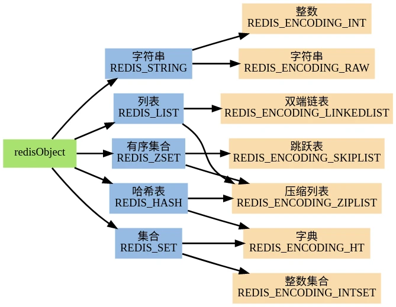

# 常见数据类型

1. String 是 Redis 最基本的类型，可以理解成与 Memcached一模一样的类型，一个 Key 对应一个 Value。Value 不仅是 String，也可以是数字。
   String 类型是二进制安全的，意思是 Redis 的 String 类型可以包含任何数据，比如 jpg 图片或者序列化的对象。String 类型的值最大能存储 512M。
   
2. Hash是一个键值（key-value）的集合。Redis 的 Hash 是一个 String 的 Key 和 Value 的映射表，Hash 特别适合存储对象。常用命令：hget，hset，hgetall 等。

3. List 列表是简单的字符串列表，按照插入顺序排序。可以添加一个元素到列表的头部（左边）或者尾部（右边） 常用命令：lpush、rpush、lpop、rpop、lrange（获取列表片段）等。
   应用场景：List 应用场景非常多，也是 Redis 最重要的数据结构之一，比如 Twitter 的关注列表，粉丝列表都可以用 List 结构来实现。
   数据结构：List 就是链表，可以用来当消息队列用。Redis 提供了 List 的 Push 和 Pop 操作，还提供了操作某一段的 API，可以直接查询或者删除某一段的元素。
   
4. Set 是 String 类型的无序集合。集合是通过 hashtable 实现的。Set 中的元素是没有顺序的，而且是没有重复的。常用命令：sdd、spop、smembers、sunion 等。

5. Zset 和 Set 一样是 String 类型元素的集合，且不允许重复的元素。常用命令：zadd、zrange、zrem、zcard 等。
   实现方式：Redis Sorted Set 的内部使用 HashMap 和跳跃表（skipList）来保证数据的存储和有序，HashMap 里放的是成员到 Score 的映射。 
   而跳跃表里存放的是所有的成员，排序依据是 HashMap 里存的 Score，使用跳跃表的结构可以获得比较高的查找效率，并且在实现上比较简单。

数据类型应用场景总结:

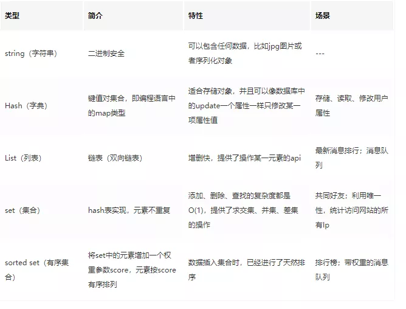

# 缓存相关

Q: 在实际项目中使用缓存有遇到什么问题或者会遇到什么问题?

A: 缓存和数据库数据一致性问题：分布式环境下非常容易出现缓存和数据库间数据一致性问题，针对这一点，如果项目对缓存的要求是强一致性的，那么就不要使用缓存。

## 缓存雪崩

"同一时间大面积key失效，导致请求直接落在数据库上。"

处理缓存雪崩简单，在批量往 Redis 存数据的时候，把每个 Key 的失效时间都加个随机值就好了，这样可以保证数据不会再同一时间大面积失效。

如果 Redis 是集群部署，将热点数据均匀分布在不同的 Redis 库中也能避免全部失效。

或者设置热点数据永不过期，有更新操作就更新缓存就好了（比如运维更新了首页商品，那你刷下缓存就好了，不要设置过期时间），电商首页的数据也可以用这个操作，保险。

## 缓存击穿

"指一个 Key 非常热点，在不停地扛着大量的请求，大并发集中对这一个点进行访问，当这个 Key 在失效的瞬间，持续的大并发直接落到了数据库上，就在这个 Key 的点上击穿了缓存。"

设置热点数据永不过期，或者加上互斥锁。

## 缓存穿透

指缓存和数据库中都没有的数据，而用户（黑客）不断发起请求。

举个例子：数据库的 id 一般都是从 1 自增的，如果发起 id=-1 的数据或者 id 特别大不存在的数据，这样的不断攻击导致数据库压力很大，严重会击垮数据库。

在接口层增加校验，比如用户鉴权，参数做校验，不合法的校验直接 return，比如 id 做基础校验，id<=0 直接拦截。

或者使用布隆过滤器，它的原理也很简单，就是利用高效的数据结构和算法快速判断出这个 Key 是否在数据库中存在，不存在 return 就好了，存在就去查 DB 刷新 KV 再 return。

# 淘汰策略

机制有定期删除和惰性删除。

具体的策略如下图：

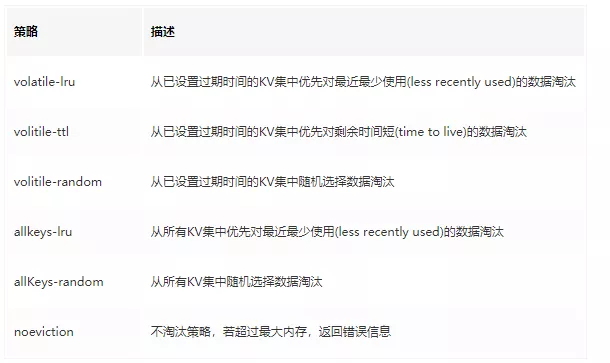

除此之外，Redis 4.0 加入了 LFU（least frequency use）淘汰策略，包括 volatile-lfu 和 allkeys-lfu，通过统计访问频率，将访问频率最少，即最不经常使用的 KV 淘汰。


# 持久化

Redis 的持久化策略有两种：

- RDB：快照形式是直接把内存中的数据保存到一个 dump 的文件中，定时保存，保存策略。

- AOF：把所有的对 Redis 的服务器进行修改的命令都存到一个文件里，命令的集合。Redis 默认是快照 RDB 的持久化方式。

当 Redis 重启的时候，它会优先使用 AOF 文件来还原数据集，因为 AOF 文件保存的数据集通常比 RDB 文件所保存的数据集更完整。

## RDB

默认 Redis 是会以快照"RDB"的形式将数据持久化到磁盘的一个二进制文件 dump.rdb。

工作原理简单：当 Redis 需要做持久化时，Redis 会 fork 一个子进程，子进程将数据写到磁盘上一个临时 RDB 文件中。

当子进程完成写临时文件后，将原来的 RDB 替换掉，这样的好处是可以 copy-on-write。

RDB 的优点是：这种文件非常适合用于备份：比如，可以在最近的 24 小时内，每小时备份一次，并且在每个月的每一天也备份一个 RDB 文件。

## AOF

使用 AOF 做持久化，每一个写命令都通过 write 函数追加到 appendonly.aof 中，配置方式如下：

```
appendfsync yes   
appendfsync always     #每次有数据修改发生时都会写入AOF文件。
appendfsync everysec   #每秒钟同步一次，该策略为AOF的缺省策略。
```

AOF 可以做到全程持久化，只需要在配置中开启 appendonly yes。这样 Redis 每执行一个修改数据的命令，都会把它添加到 AOF 文件中，当 Redis 重启时，将会读取 AOF 文件进行重放，恢复到 Redis 关闭前的最后时刻。

使用 AOF 的优点是会让 Redis 变得非常耐久。可以设置不同的 Fsync 策略，AOF的默认策略是每秒钟 Fsync 一次，在这种配置下，就算发生故障停机，也最多丢失一秒钟的数据。

缺点是对于相同的数据集来说，AOF 的文件体积通常要大于 RDB 文件的体积。根据所使用的 Fsync 策略，AOF 的速度可能会慢于 RDB。

数据库备份和灾难恢复：定时生成 RDB 快照非常便于进行数据库备份，并且 RDB 恢复数据集的速度也要比 AOF 恢复的速度快。当然了，Redis 支持同时开启 RDB 和 AOF，系统重启后，Redis 会优先使用 AOF 来恢复数据，这样丢失的数据会最少。

# 主从复制

Redis 单节点存在单点故障问题，为了解决单点问题，一般都需要对 Redis 配置从节点。

主从配置结合哨兵模式能解决单点故障问题，提高 Redis 可用性。

从节点仅提供读操作，主节点提供写操作。对于读多写少的状况，可给主节点配置多个从节点，从而提高响应效率。

## 关于复制过程，是这样的：

- 从节点执行 slaveof[masterIP][masterPort]，保存主节点信息。

- 从节点中的定时任务发现主节点信息，建立和主节点的 Socket 连接。

- 从节点发送 Ping 信号，主节点返回 Pong，两边能互相通信。

- 连接建立后，主节点将所有数据发送给从节点（数据同步）。

- 主节点把当前的数据同步给从节点后，便完成了复制的建立过程。接下来，主节点就会持续的把写命令发送给从节点，保证主从数据一致性。

### 数据同步的过程:

Redis 2.8 之前使用 sync[runId][offset] 同步命令，Redis 2.8 之后使用 psync[runId][offset] 命令。

两者不同在于，Sync 命令仅支持全量复制过程，Psync 支持全量和部分复制。

介绍同步之前，先介绍几个概念：

- runId：每个 Redis 节点启动都会生成唯一的 uuid，每次 Redis 重启后，runId 都会发生变化。

- offset：主节点和从节点都各自维护自己的主从复制偏移量 offset，当主节点有写入命令时，offset=offset+命令的字节长度。
  从节点在收到主节点发送的命令后，也会增加自己的 offset，并把自己的 offset 发送给主节点。
  这样，主节点同时保存自己的 offset 和从节点的 offset，通过对比 offset 来判断主从节点数据是否一致。
  
- repl_backlog_size：保存在主节点上的一个固定长度的先进先出队列，默认大小是 1MB。

主节点发送数据给从节点过程中，主节点还会进行一些写操作，这时候的数据存储在复制缓冲区中。

从节点同步主节点数据完成后，主节点将缓冲区的数据继续发送给从节点，用于部分复制。

主节点响应写命令时，不但会把命名发送给从节点，还会写入复制积压缓冲区，用于复制命令丢失的数据补救。

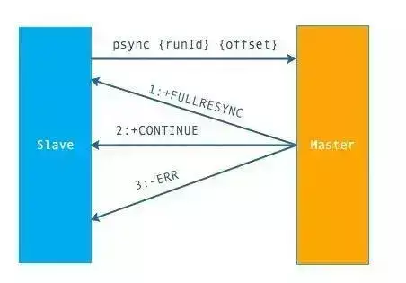

上面是 Psync 的执行流程，从节点发送 psync[runId][offset] 命令，主节点有三种响应：


- FULLRESYNC：第一次连接，进行全量复制

- CONTINUE：进行部分复制

- ERR：不支持 psync 命令，进行全量复制

### 全量复制的过程：

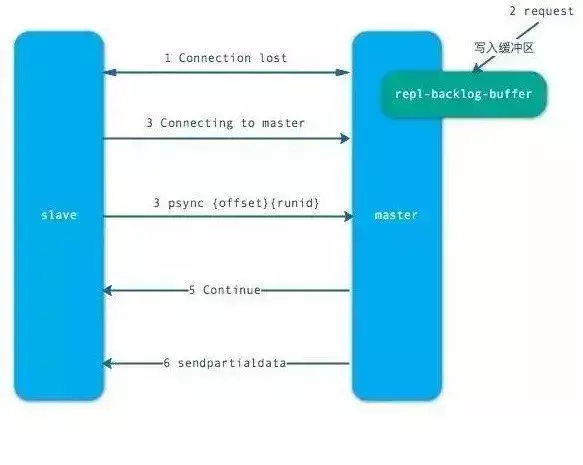

上面是全量复制的流程。主要有以下几步：

- 从节点发送 psync ? -1 命令（因为第一次发送，不知道主节点的 runId，所以为?，因为是第一次复制，所以 offset=-1）。

- 主节点发现从节点是第一次复制，返回 FULLRESYNC {runId} {offset}，runId 是主节点的 runId，offset 是主节点目前的 offset。

- 从节点接收主节点信息后，保存到 info 中。

- 主节点在发送 FULLRESYNC 后，启动 bgsave 命令，生成 RDB 文件（数据持久化）。

- 主节点发送 RDB 文件给从节点。到从节点加载数据完成这段期间主节点的写命令放入缓冲区。

- 从节点清理自己的数据库数据。

从节点加载 RDB 文件，将数据保存到自己的数据库中。如果从节点开启了 AOF，从节点会异步重写 AOF 文件。

# 哨兵

主从复制会存在以下问题：

- 一旦主节点宕机，从节点晋升为主节点，同时需要修改应用方的主节点地址，还需要命令所有从节点去复制新的主节点，整个过程需要人工干预。

- 主节点的写能力受到单机的限制。

- 主节点的存储能力受到单机的限制。

- 原生复制的弊端在早期的版本中也会比较突出，比如：Redis 复制中断后，从节点会发起 psync。

- 此时如果同步不成功，则会进行全量同步，主库执行全量备份的同时，可能会造成毫秒或秒级的卡顿。

## 哨兵架构

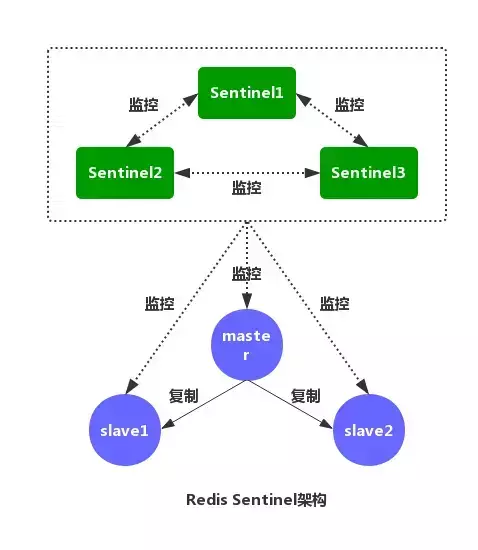

如图，是 Redis Sentinel（哨兵）的架构图。Redis Sentinel（哨兵）主要功能包括主节点存活检测、主从运行情况检测、自动故障转移、主从切换。

Redis Sentinel 最小配置是一主一从。Redis 的 Sentinel 系统可以用来管理多个 Redis 服务器。

该系统可以执行以下四个任务：

- 监控：不断检查主服务器和从服务器是否正常运行。

- 通知：当被监控的某个 Redis 服务器出现问题，Sentinel 通过 API 脚本向管理员或者其他应用程序发出通知。

- 自动故障转移：当主节点不能正常工作时，Sentinel 会开始一次自动的故障转移操作，它会将与失效主节点是主从关系的其中一个从节点升级为新的主节点，并且将其他的从节点指向新的主节点，这样人工干预就可以免了。

- 配置提供者：在 Redis Sentinel 模式下，客户端应用在初始化时连接的是 Sentinel 节点集合，从中获取主节点的信息。

## 工作原理

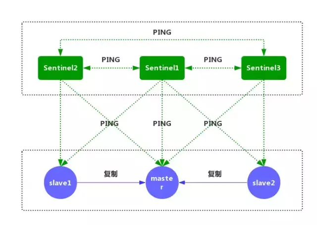

①每个 Sentinel 节点都需要定期执行以下任务：每个 Sentinel 以每秒一次的频率，向它所知的主服务器、从服务器以及其他的 Sentinel 实例发送一个 PING 命令。（如上图）

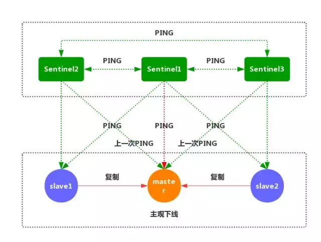

②如果一个实例距离最后一次有效回复 PING 命令的时间超过 down-after-milliseconds 所指定的值，那么这个实例会被 Sentinel 标记为主观下线。（如上图）

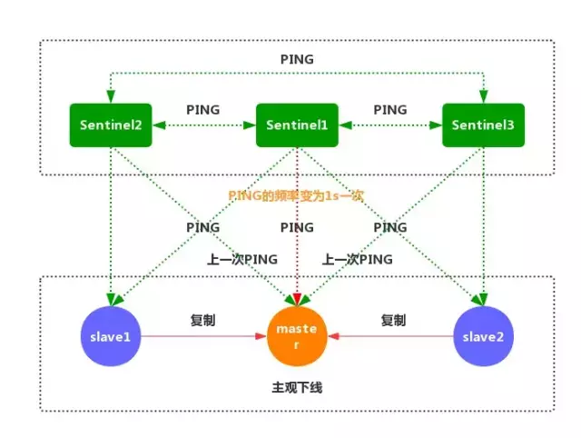

③如果一个主服务器被标记为主观下线，那么正在监视这个服务器的所有 Sentinel 节点，要以每秒一次的频率确认主服务器的确进入了主观下线状态。

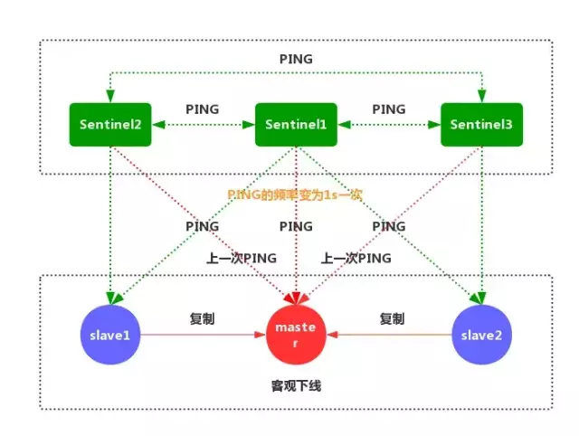

④如果一个主服务器被标记为主观下线，并且有足够数量的 Sentinel（至少要达到配置文件指定的数量）在指定的时间范围内同意这一判断，那么这个主服务器被标记为客观下线。

⑤一般情况下，每个 Sentinel 会以每 10 秒一次的频率向它已知的所有主服务器和从服务器发送 INFO 命令。

当一个主服务器被标记为客观下线时，Sentinel 向下线主服务器的所有从服务器发送 INFO 命令的频率，会从 10 秒一次改为每秒一次。

⑥Sentinel 和其他 Sentinel 协商客观下线的主节点的状态，如果处于 SDOWN 状态，则投票自动选出新的主节点，将剩余从节点指向新的主节点进行数据复制。

⑦当没有足够数量的 Sentinel 同意主服务器下线时，主服务器的客观下线状态就会被移除。

当主服务器重新向 Sentinel 的 PING 命令返回有效回复时，主服务器的主观下线状态就会被移除。

# Redis集群

Redis-Cluster采用无中心结构，每个节点保存数据和整个集群状态,每个节点都和其他所有节点连接。

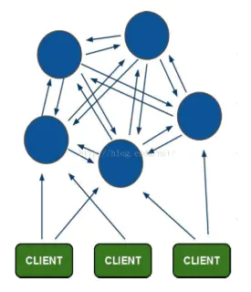

其结构特点：

1. 所有的redis节点彼此互联(PING-PONG机制),内部使用二进制协议优化传输速度和带宽。

2. 节点的fail是通过集群中超过半数的节点检测失效时才生效。

3. 客户端与redis节点直连,不需要中间proxy层.客户端不需要连接集群所有节点,连接集群中任何一个可用节点即可。

4. redis-cluster把所有的物理节点映射到[0-16383]slot上（不一定是平均分配）,cluster 负责维护node<->slot<->value。

5. Redis集群预分好16384个桶，当需要在 Redis 集群中放置一个 key-value 时，根据 CRC16(key) mod 16384的值，决定将一个key放到哪个桶中。

## 节点分配

假设三个主节点分别是：A, B, C 三个节点，它们可以是一台机器上的三个端口，也可以是三台不同的服务器。那么，采用哈希槽 (hash slot)的方式来分配16384个slot 的话，它们三个节点分别承担的slot 区间是：

- 节点A覆盖0－5460;

- 节点B覆盖5461－10922;

- 节点C覆盖10923－16383.

获取数据：

如果存入一个值，按照redis cluster哈希槽的算法： CRC16('key')384 = 6782。 那么就会把这个key 的存储分配到 B 上了。同样，当我连接(A,B,C)任何一个节点想获取'key'这个key时，也会这样的算法，然后内部跳转到B节点上获取数据

新增一个主节点:

新增一个节点D，redis cluster的这种做法是从各个节点的前面各拿取一部分slot到D上，我会在接下来的实践中实验。大致就会变成这样：

- 节点A覆盖1365-5460

- 节点B覆盖6827-10922

- 节点C覆盖12288-16383

- 节点D覆盖0-1364,5461-6826,10923-12287

同样删除一个节点也是类似，移动完成后就可以删除这个节点了。

## 主从模式

redis cluster 为了保证数据的高可用性，加入了主从模式，一个主节点对应一个或多个从节点，主节点提供数据存取，从节点则是从主节点拉取数据备份，当这个主节点挂掉后，就会有这个从节点选取一个来充当主节点，从而保证集群不会挂掉。


