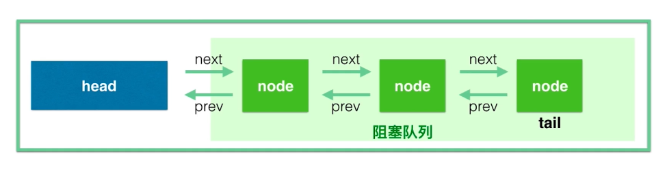

# AQS概述

AbstractQueuedSynchronizer，是一个用于构建锁、同步器、线程协作类的框架。

## Semaphore和AQS的关系

Semaphore内部有一个Sync类，Sync类继承自AQS

```java
public class Semaphore implements java.io.Serializable {
    /** All mechanics via AbstractQueuedSynchronizer subclass */
    private final Sync sync;

    /**
     * Synchronization implementation for semaphore.  Uses AQS state
     * to represent permits. Subclassed into fair and nonfair
     * versions.
     */
    abstract static class Sync extends AbstractQueuedSynchronizer {}
}
```

# AQS原理

## 三个核心部分

- state同步状态

使用volatile修饰的int型变量`private volatile int state`，在不同的线程协作类中有不同的含义。
例如在Semaphore中表示许可证的数量，在ReentrantLock中表示锁的占有情况（包括可重入计数）等。

- FIFO队列

AQS维护一个双向链表形式的等待队列，head是已经获得锁的线程，后面是等待获得的（阻塞）



- 获取/释放等重要方法

期望线程协作类自己实现

1. 获取方法
   (1)获取方法依赖state变量，经常会阻塞（比如获取不到锁的时候）
   (2)在Semaphore中，获取是acquire方法，作用是获取一个许可证（state-1）
   (3)在CountDownLatch中，获取是await方法，作用是等待直到倒数结束（state为0）
   
2. 释放方法
   (1)在Semaphore中，释放是release方法，作用是释放一个许可证（state+1）
   (2)释放是countDown方法，作用是倒数1个数（state-1）
   
# 应用实例

见`src/main/java/_并发和多线程/_AQS`