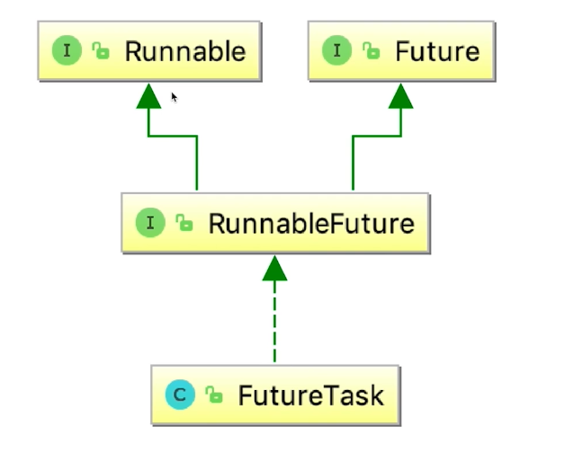

# Future类

获取线程的执行结果，执行的方法是需要实现Callable接口的call()

```java
class Task implements Callable<T> {
        @Override
        public T call() throws Exception {
            T res;
            //do something...
            return res;
        }
}
```

# Future的主要方法

- get()

获取结果

- get(long timeout, TimeUnit unit)

有超时的获取结果

- cancel()

取消任务的执行

    - 如果任务还未开始，则任务会被正常取消（即不会被执行），方法返回true
    - 如果任务已经完成/取消，则方法返回false
    - 如果任务已经在执行中，则不会直接取消该任务，而是会根据参数mayInterruptIfRunning做判断

`Future.cancle(true)`适用于：
1. 任务能够处理interrupt

`Future.cancle(false)`仅用于避免尚未启动的任务，适用于：
1. 不能处理interrupt的任务
2. 不清楚任务是否支持取消
3. 需要等待已经开始的任务执行完成

- isDone()

判断线程是否执行完毕

- isCancelled()

判断是否被取消

# FutureTask

- 使用`FutureTask`来获取`Future`和任务的结果

- `FutureTask`是一种包装器，可以把`Callable`转化成`Future`和`Runnable`，它同时实现二者的接口



下面是示例代码：

```java
public class FutureTaskDemo {
    public static void main(String[] args) throws ExecutionException, InterruptedException {
        Task task = new Task();
        FutureTask futureTask = new FutureTask<>(task);
        //1.直接创建一个线程执行
//        new Thread(futureTask).start();
        //2.使用线程池
        ExecutorService threadPool = Executors.newFixedThreadPool(5);
        threadPool.submit(futureTask);
        threadPool.shutdown();
        System.out.println(futureTask.get());
    }

    static class Task implements Callable<Integer> {

        @Override
        public Integer call() throws Exception {
            System.out.println("子线程正在计算");
            Thread.sleep(3000);
            int sum = 0;
            for (int i = 0; i < 100; i++) {
                sum += i;
            }
            return sum;
        }
    }
}
```