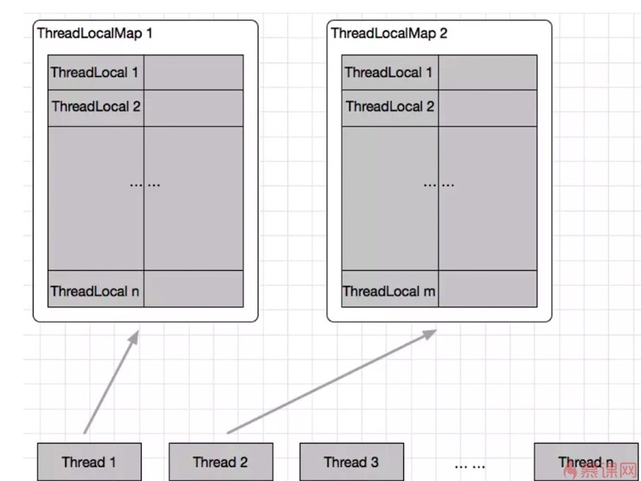

# ThreadLocal概述

## ThreadLocal两大应用场景

- 每个线程需要一个独享的对象（通常是工具类，如SimpleDateFormat和Random）

见`src/main/java/_并发和多线程/_ThreadLocal/ThreadLocalDemo1.java`

- 每个线程需要保存全局变量（例如在拦截器中获取用户信息），可以让不同方法直接使用，避免参数传递

见`src/main/java/_并发和多线程/_ThreadLocal/ThreadLocalDemo2.java`

## ThreadLocal两大作用

- 让对象在线程间隔离（每个线程都拥有自己独享的对象）

- 让对象在同一线程内不同方法中共享

# ThreadLocal优点

- 线程安全

- 不需要加锁，提高效率

- 更高效地利用内存、节省开销

例如，相比于每个任务都新建一个`SimpleDateFormat`，显然用`ThreadLocal`可以节省内存和开销

- 避免传参

更优雅、松耦合

# ThreadLocal原理

每一个`Thread`对象中都有一个`ThreadLocalMap`成员变量：



## 主要方法介绍

### initialValue()

(1)该方法会返回当前线程对应的“初始值”，这是一个**延迟加载**的方法，只有在**调用get**的时候才会触发；

(2)当线程**第一次调用get**方法访问变量时，将调用此方法，若线程此前已经调用了`set`方法将不会再调用`initialValue()`方法；

(3)通常，每个线程最多调用**一次**该方法，但如果已经调用了`remove()`后，再次调用`get()`仍会调用该方法；

(4)若不重写该方法，该方法会返回`null`。一般使用匿名内部类的方式来**重写initialValue()方法**

```java
    //默认的initialValue()方法直接返回null
    protected T initialValue() {
        return null;
    }
```

### set(T t)

为线程变量设置一个值`t`

```java
    public void set(T value) {
        //获取到当前线程
        Thread t = Thread.currentThread();
        //获取当前线程的ThreadLocalMap
        ThreadLocalMap map = getMap(t);
        //若map不为null，则直接set进去
        if (map != null)
            map.set(this, value);
        //否则，map为null，创建一个map
        else
            createMap(t, value);
    }
```

### get()

获得`ThreadLocal`对应的value:  

首先取出当前线程的`ThreadLocalMap`，然后调用`map.getEntry`方法，把本`ThreadLocal`的引用作为参数传入，获得`ThreadLocalMap`中属于本`ThreadLocal`的value

```java
    public T get() {
        //获取到当前线程
        Thread t = Thread.currentThread();
        //获取当前线程的ThreadLocalMap
        ThreadLocalMap map = getMap(t);
        //若map不为null
        if (map != null) {
            //将本`ThreadLocal`的引用作为key，找对应的value
            ThreadLocalMap.Entry e = map.getEntry(this);
            if (e != null) {
                @SuppressWarnings("unchecked")
                T result = (T)e.value;
                return result;
            }
        }
        //否则，map为null，则需要先初始化
        return setInitialValue();
    }
```

### remove()

删除本`ThreadLocal`对应的键值对

```java
     public void remove() {
         ThreadLocalMap m = getMap(Thread.currentThread());
         if (m != null)
             m.remove(this);
     }
```

# ThreadLocalMap

## 数据结构

`ThreadLocalMap`是每个线程`Thread`类的成员变量，里面维护了一个键值对数组`Entry[] table`:

- 键key：ThreadLocal(this)

- 值value：实际需要的变量，例如`simpleDateFormat`对象

## hash冲突

- `HashMap`解决hash冲突的办法是**拉链法**（JDK1.8 链表+红黑树）

- `ThreadLocalMap`解决hash冲突的办法是**线性探测法**

# ThreadLocal注意点

## 内存泄漏

内存泄漏：某个对象使用完毕，但是占用的内存却不能被回收，结果可能会导致OOM（内存溢出）

### 强引用弱引用

`ThreadLocalMap`的Entry继承自**WeakReference**，对key是弱引用，同时对value是强引用（赋值操作）

```java
static class Entry extends WeakReference<ThreadLocal<?>> {
            /** The value associated with this ThreadLocal. */
            Object value;

            Entry(ThreadLocal<?> k, Object v) {
                //弱引用
                super(k);
                //赋值，强引用
                value = v;
            }
        }
```

正常情况下，当线程终止，保存在`ThreadLocal`里的value会被GC。
但是，如果线程不终止，那么key对应的value就不能被回收，而key是弱引用（下一次GC时将被回收），因此导致value无法回收，久之可能出现OOM。

### JDK的考虑

在set，remove，rehash方法中会**判断key为null的Entry，并把对应的value设置为null**  

但是存在一个问题，如果一个`ThreadLocal`不被使用，那么set，remove，rehash方法也不会被调用。

### 避免内存泄漏

使用完`ThreadLocal`后，应该调用`remove()`方法删除对应的Entry对象

## 空指针异常

默认情况下，`ThreadLocal`的值及时不初始化或set，调用`get()`方法也不会抛出空指针异常，而是返回`null`。但是如下情况例外：  

`ThreadLocal`的泛型指定为基本类型的包装类型，当未设置初值就直接调用`get()`方法时，获得的是一个`null`值，但如果使用基本类型接收，则可能抛出空指针异常。因为这里涉及到**装箱拆箱**的问题。  

例如：指定泛型为包装类型`Long`，接收时使用基本类型`long`，那么在拆箱时将抛出空指针异常。

## ThreadLocal在Spring中的应用

- 如果可以不用ThreadLocal就能解决问题，那么不要强行使用

- 优先使用框架支持

例如在Spring中，如果可以使用`RequestContextHolder`或`DateTimeContextHolder`那么就不需要自己维护ThreadLocal，因为有可能忘记调用`remove()`方法等，造成内存泄漏  

每次HTTP请求都对应一个线程，线程之间相互隔离，这也是`ThreadLocal`的典型应用场景

