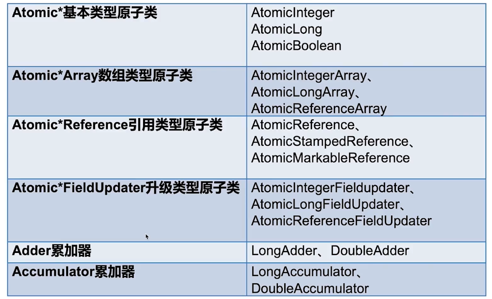
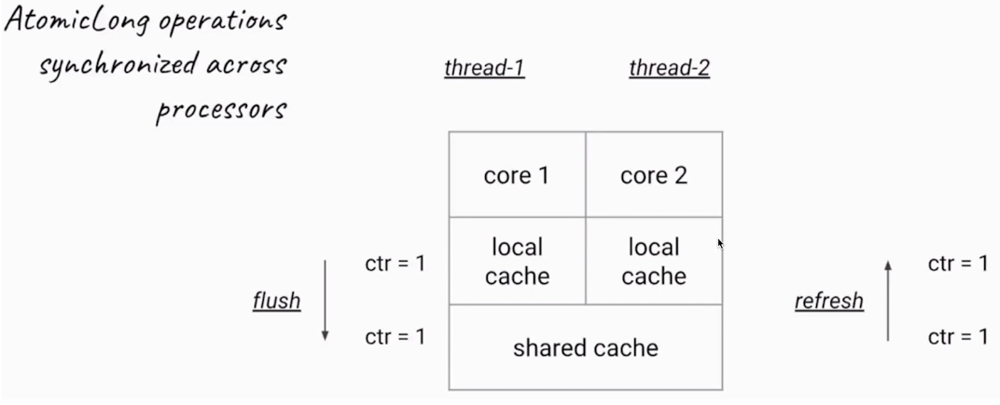
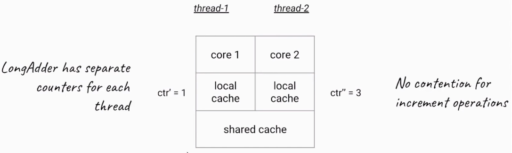

# 原子类

1. 什么是原子类，有什么作用

2. 6类原子类纵览

3. `Atomic*`基本类型原子类，以`AtomicInteger`为例

4. `Atomic*Array`数组类型原子类

5. `Atomic*Reference`引用类型原子类

6. 把普通变量升级为原子类：用`AtomicIntegerFieldUpdater`

7. Adder累加器

8. Accumulator累加器

# 什么是原子类，有什么作用

- 不可分割

- 一个操作是不可中断的，即便是多线程的情况下也可以保证

- `java.util.concurrent.atomic`

- 原子类的作用和锁类似，都是为了保证并发情况下**线程安全**，不过原子类有一定的优势

    - 粒度更细：原子变量可以把竞争范围缩小到变量级别
    - 性能更高：通常，使用原子类的效率会比使用锁的效率更高（除了高度竞争的情况）
    
# 6类原子类纵览



# Atomic*基本类型原子类，以AtomicInteger为例

## AtomicInteger常用方法

- `get()` 获取当前变量的值

- `getAndSet(int newValue)` 获取当前变量的值，并设置为新的值

- `getAndIncrement()` 获取当前变量的值，并自增

- `getAndDecrement()` 获取当前变量的值，并自减

- `getAndAdd(int delta)` 获取当前变量的值，并加上预期的值

- `boolean compareAndSet(int expect,int update)` 如果当前变量的值等于预期的值，则更新当前变量的值为`update`

# Atomic*Array数组类型原子类

```java
//声明
AtomicIntegerArray array=new AtomicIntegerArray(1000);
//第i个元素自增
array.getAndIncrement(i)
```

# Atomic*Reference引用类型原子类

`AtomicReference`类的作用，和`AtomicInteger`并没有本质区别，`AtomicInteger`可以让一个整数保证原子性，而`AtomicReference`可以让一个**对象**保证原子性

# 把普通变量升级为原子类：用AtomicIntegerFieldUpdater

- `AtomicIntegerFieldUpdater`对普通变量进行升级

- 使用场景：偶尔需要一个原子get-set操作（相当于只作用于该次操作，不会创建额外的变量，或改变原有的变量）

- 可见范围(通过反射，变量不能是private?)

- 不支持`static`

## 示例

```java
class Candidate {
  //volatile保证可见性
  volatile int score;
}

Candidate person1;
Candidate person2;

public AtomicIntegerFieldUpdater<Candidate> scoreUpdater = AtomicIntegerFieldUpdater.newUpdater(Candidate.class,
        "score");

//当某个Candidate对象需要对score执行原子操作时，可以使用scoreUpdater，例如
scoreUpdater.getAndIncrement(person1);
```

# Adder累加器

- JDK1.8引入

- 高并发下`LongAdder`比`AtomicLong`效率高，不过本质上是空间换时间

- 竞争激烈的时候，`LongAdder`把不同线程对应到不同的`Cell`上进行修改，降低了冲突的概率，是**多段锁**的概念，提高了并发性

## AtomicLong的弊端



`AtomicLong`每一次加法，都要`flush`和`refresh`，`flush`是把工作内存写入到主内存，`refresh`是把主内存读入工作内存，以此保证数据一致性（JMM）

## LongAdder带来的改进和原理



- 在内部，`LongAdder`的实现原理和`AtomicLong`是不同的
  
- `AtomicLong`每一次加法都需要做同步，所以在高并发的时候会导致冲突比较多

- `LongAdder`，每个线程会有自己的一个计数器，仅仅用来在线程内计数，所以在做加法的时候，不需要同步机制，也不需要`flush`和`refresh`

- 引入了分段累加的概念，内部有一个base变量和一个Cell[]数组共同参与计数

- base变量：竞争不激烈时，直接累加到该变量上

- Cell[]数组：竞争激烈时，各个线程分散累加到自己的hash槽Cell[i]中

- sum源码分析

```java
public long sum(){
    Cell[] as=cells;
    Cell a;
    long sum=base;
    if(as!=null){
        for(int i=0;i<as.length;++i){
            if((a==as[i])!=null){
                sum+=a.value;
            }
        }
    }
    return sum;
}
```

## 对比AtomicLong和LongAdder

- 在低争用下，`AtomicLong`和`LongAdder`这两个类具有相似的特征。但在竞争激烈的情况下，`LongAdder`的预期吞吐量高高得多，但要消耗更多的空间

- `LongAdder`适合的场景是统计求和计数的场景，而且`LongAdder`基本只提供了add方法，而`AtomicLong`还具有cas方法

# Accumulator累加器

- 更普通版本的Adder

- 使用场景：大量计算并行计算（计算的顺序不影响计算的结果）

# 总结


