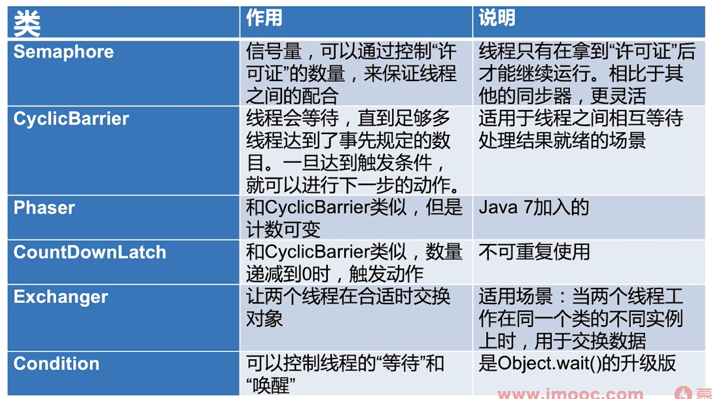

# 同步器

常见的同步器如下图所示：

# CountDownLatch

## 类的主要方法

- CountDownLatch(int count)

仅有一个构造函数，参数`count`为需要倒数的数值

- await()

调用`await()`方法的线程会被挂起，它会等待直到`count`值为0才继续执行

- countDown()

将`count`值减1，直到为0时，等待的线程会被唤起

## 两个典型用法

- 用法一：一个线程等待多个线程都执行完毕，再继续自己的工作

见`src/main/java/_并发和多线程/_常见的同步器/_countDownLatch/CountDownLatchDemo1.java`

- 用法二：多个线程等待某一个线程的信号，同时开始执行

见`src/main/java/_并发和多线程/_常见的同步器/_countDownLatch/CountDownLatchDemo2.java`

- 用法三：用法一和用法二结合

见`src/main/java/_并发和多线程/_常见的同步器/_countDownLatch/CountDownLatchDemo3.java`

## 总结

- 两个典型用法

- 创建时传递`count`参数，`count`为0时，之前等待的线程会继续执行

- `CountDownLatch`不能够重用，如果需要重新计数，可以考虑使用`CyclicBarrier`或创建新的`CountDownLatch`实例

# Semaphore

- `Semaphore`可以用来限制或管理数量有限的资源的使用情况(控制并发量)

- `Semaphore`的作用是维护一个**许可证**的计数，线程可以获取许可证，那`Semaphore`剩余的许可证就减一，线程也可以释放一个许可证，那`Semaphore`剩余的许可证就加一。当`Semaphore
  `所拥有的许可证数量为0时，下一个想要获取许可证的线程就要等待，直到其他线程释放许可证
  
## Semaphore使用流程

1. 初始化`Semaphore`并指定许可证的数量

2. 执行一个任务前调用`acquire()`方法获取许可证

3. 任务执行结束后调用`release()`方法释放许可证

## Semaphore主要方法

- `new Semaphore(int permits, boolean fair)`

这里可以设置使用使用**公平**策略，如果传入`true`那么`Semaphore`会把之前等待的线程放到FIFO的队列里，以便于当有了新的许可证，可以分发给之前等了最长时间的线程

- `tryAcquire()`

看看现在有没有空闲的许可证，若有则获取，否则不会陷入阻塞，可以去做别的事，过一会再来查看

- `tryAcquire(timeout)`

和`tryAcquire()`一样，只是多了一个超时时间，比如“在3秒内获取不到许可证，线程就去做别的事”

- `acquire()`

- `release()`

## 特殊用法

- 一次性获取或释放**多个**许可证

比如TaskA会调用很消耗资源的method1()，而TaskB调用的是不太消耗资源的method2()，这样可以要求TaskA获取5个许可证才能执行，而TaskB只需要获取1个许可证就能执行。这样就可以根据实际的需求合理分配资源

## 注意点

- 获取和释放的许可证的数量必须**一致**（这是编程规范，否则容易出错）

- 注意在初始化的`Semaphore`时候设置**公平性**，一般设置true会更合理

- 并非必须由获取许可证的线程释放许可证，事实上，获取和释放许可证对线程并无要求，也许是A获取然后B释放，只要逻辑合理即可

- `Semaphore`的作用，除了控制临界区最多同时有N个线程访问外，另一个作用是可以实现“条件等待”。例如线程1需要在线程2完成准备工作后才能开始工作，那么线程1`acquire()`，线程2完成任务后`release()
  `，这样相当于**轻量级的CountDownLatch**
  
# Condition

`Condition`的作用为

- 当线程1需要等待某个条件的时候，它就去执行`condition.await()`方法，一旦执行了了`await()`方法，线程就会进入阻塞状态

- 然后通常会有另外一个线程，假设是线程2，去执行对应的条件，直到条件达成的时候，线程2就会去执行`condition.signal()`方法，这时线程1就会被唤醒

## signal()和signalAll()

- `signalAll()`会唤起所有正在等待的线程

- `signal()`是公平的，只会唤起那个等待时间最长的线程

## 普通示例

见`src/main/java/_并发和多线程/_常见的同步器/_condition/ConditionDemo1.java`

## 用Condition实现生产者消费者模式

见`src/main/java/_并发和多线程/_常见的同步器/_condition/ConditionDemo2.java`

## Condition注意点

- 实际上，如果说`Lock`用来替代`synchronized`，那么`Condition`就是用来替代对应的`Object.wait/notify`的，所以在用法和性质上，几乎都一样

- `await`方法会自动释放持有的Lock锁，和`Object.wait`一样，不需要手动先释放锁

- 调用`await`的时候，必须持有锁，否则会抛出异常，和`Object.wait`一样

# CyclicBarrier

- `CyclicBarrier`循环栅栏和`CountDownLatch`很类似，都能阻塞一组线程

- 当有大量线程相互配合，分别计算不同任务，并且需要最后统一汇总的时候，可以使用`CyclicBarrier`。`CyclicBarrier
  `可以构造一个集结点，当某一个线程执行完毕，它就回到集结点等待，直到所有线程都到了集结点，那么该栅栏就会被撤销，所有线程再统一出发，继续执行的剩下的任务
  
- 生活中的例子：“一个班的同学（假设有10个）集合去春游，每次集合5个人这一组就出发”

见`src/main/java/_并发和多线程/_常见的同步器/_cyclicBarrier/CyclicBarrierDemo.java`

## CyclicBarrier和CountDownLatch的区别

- 作用不同

`CyclicBarrier`要等固定数量的线程都到达了栅栏位置才能继续执行，而`CountDownLatch`只需等待数字到0，也就是说，`CountDownLatch`用于事件，而`CyclicBarrier`是用于线程的

- 可重用性不同

`CountDownLatch`在倒数到0并出发门栓打开后，就不能再次使用了，除非创建新的实例；而`CyclicBarrier`可以重复使用

