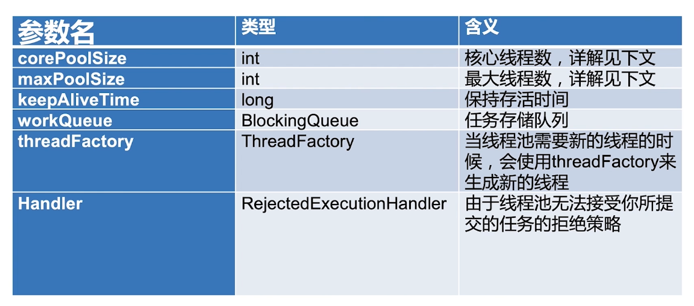
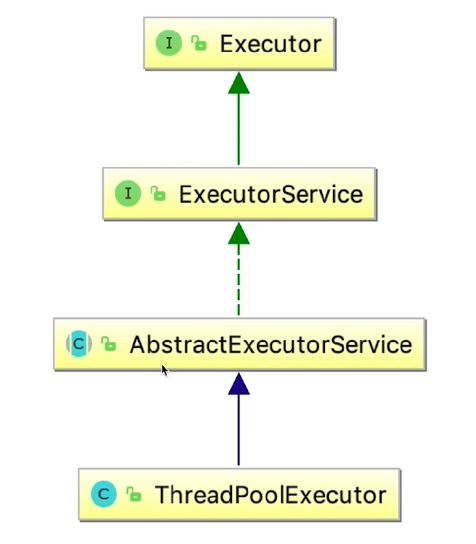

# 线程池概述

线程池的好处

- 加快响应速度

- 合理利用CPU和内存

- 统一管理

适用场景

- 服务器接受大量请求时使用线程池，可以减少线程创建和销毁次数，提高工作效率

- 实际开发中，如果需要创建5个以上的线程，就可以使用线程池来管理

# 线程池的构造函数

## corePoolSize和maxPoolSize

- corePoolSize核心线程数  

线程池在完成初始化后，默认情况下，没有任何线程，线程池会等待有任务到来时，再创建新线程去执行任务
  
- maxPoolSize最大线程数  

线程池可能会在核心线程数的基础上，额外增加一些线程，上限就是maxPoolSize

## 添加线程规则

1. 若线程数小于corePoolSize，即使其他工作线程处于空闲状态，也会创建一个新线程来运行新任务

2. 若线程数达到corePoolSize但小于maxPoolSize，则将任务放入队列

3. 若队列已满，并且线程数小于maxPoolSize，则创建一个新线程来运行任务

4. 若队列已满，且线程数达到maxPoolSize，则拒绝该任务

## 增减线程的特点

1. 通过设置corePoolSize和maxPoolSize相等，可以实现固定大小的线程池

2. 线程池希望保持较少的线程数，并且只有在负载变得很大时才增加新的线程

3. 通过设置maxPoolSize为很大的值（例如Integer.MAX_VALUE），可以允许线程池容纳任意数量的并发任务

4. 只有在队列满时才创建多余corePoolSize的线程，因此若队列使用的是无界队列（例如LinkedBlockingQueue），那么线程数就不会超过corePoolSize

## keepAliveTime

如果线程池的线程数多于corePoolSize，多余的这部分线程的空闲时间超过keepAliveTime，它们就会被回收

## ThreadFactory

新的线程是由ThreadFactory创建的，默认使用Executors.defaultThreadFactory()，创建出来的线程都在同一个线程组，拥有同样的优先级并且都不是守护线程。
如果自定义指定ThreadFactory，那么就可以改变线程名、线程组、优先级、是否为守护线程等。

## workQueue

有三种常见的队列类型：

1. 直接交接：SynchronousQueue

2. 无界队列：LinkedBlockingQueue

3. 有界队列：ArrayBlockingQueue

# 线程池用法

## 常见的几种线程池

|  | 核心线程数 | 最大线程数 | 阻塞队列 |
| - | - | - | - |
| newFixedThreadPool | n | n | LinkedBlockingQueue |
| newSingleThreadExecutor | 1 | 1 | LinkedBlockingQueue |
| newCachedThreadPool | 0 | Integer.MAX_VALUE | SynchronousQueue |
| newScheduledThreadPool | n | Integer.MAX_VALUE | DelayedWorkQueue |

- newFixedThreadPool

- newSingleThreadExecutor

- newCachedThreadPool

- newScheduledThreadPool

- workStealingPool  

JDK1.8加入的，适用于可以产生子任务的情况（例如二叉树），拥有一定窃取能力（其他线程可以帮助未完成的线程的来执行任务）

## 线程数量的设定

《Java并发编程实战》的作者Brain Goetz推荐的计算方法如下：

线程数=CPU核心数*（1+平均等待时间/平均工作时间）

- CPU密集型（加密、计算hash等）  

在CPU被充分利用的情况下，线程数不用太多，最佳的线程数可以设置为CPU核心数的1~2倍。因为CPU基本是满负荷运行，设置过多的线程会导致不必要的上下文切换。

- 耗时IO型（读写数据库、文件、网络读写等）  

对于IO密集型任务最大线程数一般会大于CPU核心数很多倍，因为IO读写速度相比于CPU的速度而言是比较慢的， 如果我们设置过少的线程数，就可能导致CPU资源的浪费。而如果我们设置更多的线程数，那么当一部分线程正在等待IO的时候， 它们此时并不需要CPU来计算，那么另外的线程便可以利用CPU去执行其他的任务，互不影响，这样的话在任务队列中等待的任务就会减少，可以更好地利用资源。

# 线程池的停止

- shutdown  

拒绝新任务，将存量任务执行完

- isShutdown

返回bool值，是否执行了shutdown

- awaitTermination

返回bool值，指定时间内是否运行完毕

- shutdownNow

正在执行的线程收到中断，队列中等待的线程将被返回（list）

# 线程池拒绝策略

## 拒绝时机

- 当Executor关闭时，提交新任务会被拒绝

- 队列容量和最大线程数已满时，提交新任务会被拒绝

## 4种拒绝策略

- AbortPolicy

抛出异常

- DiscardPolicy

丢弃，且不会得到通知

- DiscardOldestPolicy

丢弃队列中存在时间最久的任务

- CallerRunsPolicy

让提交者线程（比如主线程）去执行任务，避免了任务损失且在执行期间无法继续提交新任务便可以给线程池一定的缓冲时间

# 线程池实现原理

## 线程池组成部分

- 线程池管理器

- 工作线程

- 任务队列

- 任务接口

## Executor家族

- Executors

工具类，可以快速创建线程池（类似于Collections）

## 线程池实现复用的原理

- 相同线程执行不同任务

其实就是拿到task，然后执行task的run方法

# 线程池状态

- RUNNING：接受新任务并处理排队任务

- SHUTDOWN：不接受新任务，但处理排队任务

- STOP：不接受新任务，也不处理排队任务，并中断正在进行的任务

- TIDYING：整洁，所有任务都已终止，workerCount为0时，线程会转换到该状态，并将运行terminate()方法

- TERMINATED：terminate()运行完成