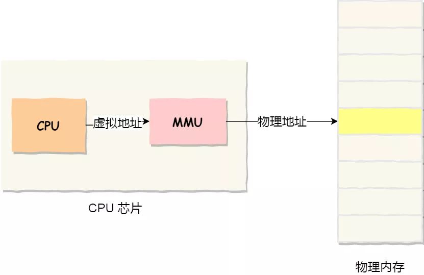
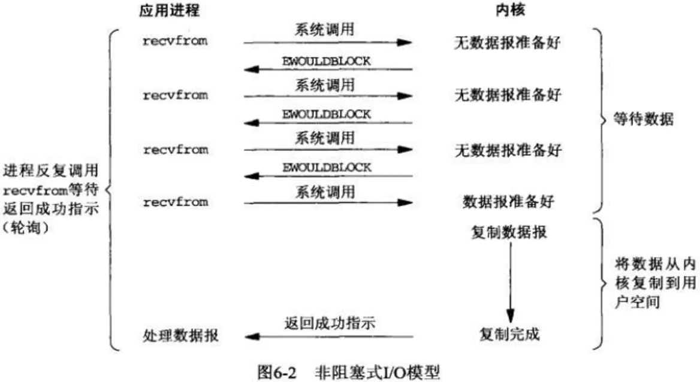

# 操作系统

# 基础概念

## 中断&系统调用

### 什么是中断

中断（interrupt）是计算机系统中的基本机制之一。即：在计算机运行过程中，当发生某个事件后，CPU 会停止当前程序流，转而去处理该事件，并在处理完毕后继续执行原程序流。

### 为什么引入中断

中断机制的好处是 化主动为被动，避免 CPU 轮询等待某条件成立。如果没有中断机制，那么“某个条件成立”就需要 CPU 轮询判断，这样就会增加系统的开销。而使用中断机制，就可以在条件成立之后，向 CPU 发送中断事件，强制中断 CPU 执行程序，转而去执行中断处理程序。

### 中断类型

1. 硬中断：由外部设备（例如：磁盘，网卡，键盘，时钟）产生，用来通知操作系统外设状态变化。

**时钟中断： 一种硬中断，用于定期打断 CPU 执行的线程，以便切换给其他线程以得到执行机会。**

2. 软中断：是一条 CPU 指令，由当前正在运行的进程产生。

**系统调用： 是一种软中断处理程序，用于让程序从用户态陷入内核态，以执行相应的操作。**

### 内和空间&用户空间

1. 内核空间：操作系统（Operating System）是管理计算机硬件与软件资源的程序，操作系统内核驻留在受保护的内核空间。

2. 用户空间：应用是运行在操作系统上运行的程序，工作在用户空间。

处于安全性和稳定性考虑，用户空间程序无法直接执行内核代码（例如：I/O 读写、创建新进程/线程），也无法访问内核数据，必须通过系统调用。

### 系统调用

系统调用（Syscall） 是一种软中断处理程序，用于让程序从用户态陷入内核态，以执行相应的操作。

当发生系统调用时，会让程序从用户态陷入内核态，以执行相应的操作。

系统调用中断处理程序的流程：

1. 程序从用户态陷入内核态

2. 根据系统调用号，在系统调用表中查找对应的系统调用函数的内存地址，执行系统调用函数。

3. 程序从内核态返回用户态

# 内存管理

## 虚拟内存

- 程序所使用的内存地址叫做虚拟内存地址（Virtual Memory Address）

- 实际存在硬件里面的空间地址叫物理内存地址（Physical Memory Address）

操作系统引入了虚拟内存，进程持有的虚拟地址会通过 CPU 芯片中的内存管理单元（MMU）的映射关系，来转换变成物理地址，然后再通过物理地址访问内存，如下图所示：



```
操作系统是如何管理虚拟地址与物理地址之间的关系？
```

主要有两种方式，分别是内存分段和内存分页。

## 内存分段

程序是由若干个逻辑分段组成的，如可由代码分段、数据分段、栈段、堆段组成。不同的段是有不同的属性的，所以就用分段（Segmentation）的形式把这些段分离出来。

```
分段机制下，虚拟地址和物理地址是如何映射的？
```

分段机制下的虚拟地址由两部分组成，段选择子和段内偏移量。


- 段选择子就保存在段寄存器里面。段选择子里面最重要的是段号，用作段表的索引。段表里面保存的是这个段的基地址、段的界限和特权等级等。

- 虚拟地址中的段内偏移量应该位于 0 和段界限之间，如果段内偏移量是合法的，就将段基地址加上段内偏移量得到物理内存地址。

在上面了，知道了虚拟地址是通过段表与物理地址进行映射的，分段机制会把程序的虚拟地址分成 4 个段，每个段在段表中有一个项，在这一项找到段的基地址，再加上偏移量，于是就能找到物理内存中的地址，如下图：


如果要访问段 3 中偏移量 500 的虚拟地址，我们可以计算出物理地址为，段 3 基地址 7000 + 偏移量 500 = 7500。

分段的办法很好，解决了程序本身不需要关心具体的物理内存地址的问题，但它也有一些不足之处：

- 第一个就是内存碎片的问题。

- 第二个就是内存交换的效率低的问题。

这里的内存碎片的问题共有两处地方：

- 外部内存碎片，也就是产生了多个不连续的小物理内存，导致新的程序无法被装载；

- 内部内存碎片，程序所有的内存都被装载到了物理内存，但是这个程序有部分的内存可能并不是很常使用，这也会导致内存的浪费；

解决外部内存碎片的问题就是内存交换。这个内存交换空间，在 Linux 系统里，也就是我们常看到的 Swap 空间，这块空间是从硬盘划分出来的，用于内存与硬盘的空间交换。

```
再来看看，分段为什么会导致内存交换效率低的问题？
```

对于多进程的系统来说，用分段的方式，内存碎片是很容易产生的，产生了内存碎片，那不得不重新 Swap 内存区域，这个过程会产生性能瓶颈。

因为硬盘的访问速度要比内存慢太多了，每一次内存交换，我们都需要把一大段连续的内存数据写到硬盘上。

##　内存分页

分段的好处就是能产生连续的内存空间，但是会出现内存碎片和内存交换的空间太大的问题。

分页是把整个虚拟和物理内存空间切成一段段固定尺寸的大小。这样一个连续并且尺寸固定的内存空间，我们叫页（Page）。在 Linux 下，每一页的大小为 4KB。

虚拟地址与物理地址之间通过页表来映射，如下图：


页表实际上存储在 CPU 的内存管理单元 （MMU） 中，于是 CPU 就可以直接通过 MMU，找出要实际要访问的物理内存地址。

而当进程访问的虚拟地址在页表中查不到时，系统会产生一个缺页异常，进入系统内核空间分配物理内存、更新进程页表，最后再返回用户空间，恢复进程的运行。

```
分页是怎么解决分段的内存碎片、内存交换效率低的问题？
```

由于内存空间都是预先划分好的，也就不会像分段会产生间隙非常小的内存，这正是分段会产生内存碎片的原因。而采用了分页，那么释放的内存都是以页为单位释放的，也就不会产生无法给进程使用的小内存。

如果内存空间不够，操作系统会把其他正在运行的进程中的「最近没被使用」的内存页面给释放掉，也就是暂时写在硬盘上，称为换出（Swap Out）。一旦需要的时候，再加载进来，称为换入（Swap In）。所以，一次性写入磁盘的也只有少数的一个页或者几个页，不会花太多时间，内存交换的效率就相对比较高。


更进一步地，分页的方式使得我们在加载程序的时候，不再需要一次性都把程序加载到物理内存中。我们完全可以在进行虚拟内存和物理内存的页之间的映射之后，并不真的把页加载到物理内存里，而是只有在程序运行中，需要用到对应虚拟内存页里面的指令和数据时，再加载到物理内存里面去。

```
分页机制下，虚拟地址和物理地址是如何映射的？
```

在分页机制下，虚拟地址分为两部分，页号和页内偏移。页号作为页表的索引，页表包含物理页每页所在物理内存的基地址，这个基地址与页内偏移的组合就形成了物理内存地址，见下图。


总结一下，对于一个内存地址转换，其实就是这样三个步骤：

- 把虚拟内存地址，切分成页号和偏移量；

- 根据页号，从页表里面，查询对应的物理页号；

- 直接拿物理页号，加上前面的偏移量，就得到了物理内存地址。

```
简单的分页有什么缺陷吗？
```

有空间上的缺陷。

因为操作系统是可以同时运行非常多的进程的，那这不就意味着页表会非常的庞大。

在 32 位的环境下，虚拟地址空间共有 4GB，假设一个页的大小是 4KB（2^12），那么就需要大约 100 万 （2^20） 个页，每个「页表项」需要 4 个字节大小来存储，那么整个 4GB 空间的映射就需要有 4MB 的内存来存储页表。

这 4MB 大小的页表，看起来也不是很大。但是要知道每个进程都是有自己的虚拟地址空间的，也就说都有自己的页表。

那么，100 个进程的话，就需要 400MB 的内存来存储页表，这是非常大的内存了，更别说 64 位的环境了。

### 多级页表

要解决上面的问题，就需要采用的是一种叫作多级页表（Multi-Level Page Table）的解决方案。

在前面我们知道了，对于单页表的实现方式，在 32 位和页大小 4KB 的环境下，一个进程的页表需要装下 100 多万个「页表项」，并且每个页表项是占用 4 字节大小的，于是相当于每个页表需占用 4MB 大小的空间。

我们把这个 100 多万个「页表项」的单级页表再分页，将页表（一级页表）分为 1024 个页表（二级页表），每个表（二级页表）中包含 1024 个「页表项」，形成二级分页。如下图所示：


```
你可能会问，分了二级表，映射 4GB 地址空间就需要 4KB（一级页表）+ 4MB（二级页表）的内存，这样占用空间不是更大了吗？
```

其实我们应该换个角度来看问题，还记得计算机组成原理里面无处不在的局部性原理么？

每个进程都有 4GB 的虚拟地址空间，而显然对于大多数程序来说，其使用到的空间远未达到 4GB，因为会存在部分对应的页表项都是空的，根本没有分配，对于已分配的页表项，如果存在最近一定时间未访问的页表，在物理内存紧张的情况下，操作系统会将页面换出到硬盘，也就是说不会占用物理内存。

如果使用了二级分页，一级页表就可以覆盖整个 4GB 虚拟地址空间，但如果某个一级页表的页表项没有被用到，也就不需要创建这个页表项对应的二级页表了，即可以在需要时才创建二级页表。做个简单的计算，假设只有 20% 的一级页表项被用到了，那么页表占用的内存空间就只有 4KB（一级页表） + 20% * 4MB（二级页表）= 0.804MB
，这对比单级页表的 4MB 是不是一个巨大的节约？

那么为什么不分级的页表就做不到这样节约内存呢？我们从页表的性质来看，保存在内存中的页表承担的职责是将虚拟地址翻译成物理地址。假如虚拟地址在页表中找不到对应的页表项，计算机系统就不能工作了。所以页表一定要覆盖全部虚拟地址空间，不分级的页表就需要有 100 多万个页表项来映射，而二级分页则只需要 1024 个页表项（此时一级页表覆盖到了全部虚拟地址空间，二级页表在需要时创建）。

我们把二级分页再推广到多级页表，就会发现页表占用的内存空间更少了，这一切都要归功于对局部性原理的充分应用。

对于 64 位的系统，两级分页肯定不够了，就变成了四级目录，分别是：

- 全局页目录项 PGD（Page Global Directory）；

- 上层页目录项 PUD（Page Upper Directory）；

- 中间页目录项 PMD（Page Middle Directory）；

- 页表项 PTE（Page Table Entry）；


### TLB

多级页表虽然解决了空间上的问题，但是虚拟地址到物理地址的转换就多了几道转换的工序，这显然就降低了这俩地址转换的速度，也就是带来了时间上的开销。

程序是有局部性的，即在一段时间内，整个程序的执行仅限于程序中的某一部分。相应地，执行所访问的存储空间也局限于某个内存区域。

我们就可以利用这一特性，把最常访问的几个页表项存储到访问速度更快的硬件，于是计算机科学家们，就在 CPU 芯片中，加入了一个专门存放程序最常访问的页表项的 Cache，这个 Cache 就是 TLB（Translation Lookaside Buffer） ，通常称为页表缓存、转址旁路缓存、快表等。


在 CPU 芯片里面，封装了内存管理单元（Memory Management Unit）芯片，它用来完成地址转换和 TLB 的访问与交互。

有了 TLB 后，那么 CPU 在寻址时，会先查 TLB，如果没找到，才会继续查常规的页表。

TLB 的命中率其实是很高的，因为程序最常访问的页就那么几个。

##　段页式内存管理

内存分段和内存分页并不是对立的，它们是可以组合起来的在同一个系统中使用的，那么组合起来后，通常称为段页式内存管理。


段页式内存管理实现的方式：

- 先将程序划分为多个有逻辑意义的段，也就是前面提到的分段机制；

- 接着再把每个段划分为多个页，也就是对分段划分出来的连续空间，再划分固定大小的页；

这样，地址结构就由段号、段内页号和页内位移三部分组成。

用于段页式地址变换的数据结构是每一个程序一张段表，每个段又建立一张页表，段表中的地址是页表的起始地址，而页表中的地址则为某页的物理页号，如图所示：


段页式地址变换中要得到物理地址须经过三次内存访问：

- 第一次访问段表，得到页表起始地址；

- 第二次访问页表，得到物理页号；

- 第三次将物理页号与页内位移组合，得到物理地址。

可用软、硬件相结合的方法实现段页式地址变换，这样虽然增加了硬件成本和系统开销，但提高了内存的利用率。

## Linux内存管理

Linux 内存主要采用的是页式内存管理，但同时也不可避免地涉及了段机制。

这主要是上面 Intel 处理器发展历史导致的，因为 Intel X86 CPU 一律对程序中使用的地址先进行段式映射，然后才能进行页式映射。既然 CPU 的硬件结构是这样，Linux 内核也只好服从 Intel 的选择。

但是事实上，Linux 内核所采取的办法是使段式映射的过程实际上不起什么作用。也就是说，“上有政策，下有对策”，若惹不起就躲着走。

Linux 系统中的每个段都是从 0 地址开始的整个 4GB 虚拟空间（32 位环境下），也就是所有的段的起始地址都是一样的。这意味着，Linux 系统中的代码，包括操作系统本身的代码和应用程序代码，所面对的地址空间都是线性地址空间（虚拟地址），这种做法相当于屏蔽了处理器中的逻辑地址概念，段只被用于访问控制和内存保护。

```
我们再来瞧一瞧，Linux 的虚拟地址空间是如何分布的？
```

在 Linux 操作系统中，虚拟地址空间的内部又被分为内核空间和用户空间两部分，不同位数的系统，地址空间的范围也不同。比如最常见的 32 位和 64 位系统，如下所示：


通过这里可以看出：

- 32 位系统的内核空间占用 1G，位于最高处，剩下的 3G 是用户空间；

- 64 位系统的内核空间和用户空间都是 128T，分别占据整个内存空间的最高和最低处，剩下的中间部分是未定义的。

再来说说，内核空间与用户空间的区别：

- 进程在用户态时，只能访问用户空间内存；

- 只有进入内核态后，才可以访问内核空间的内存；

虽然每个进程都各自有独立的虚拟内存，但是每个虚拟内存中的内核地址，其实关联的都是相同的物理内存。这样，进程切换到内核态后，就可以很方便地访问内核空间内存。


接下来，进一步了解虚拟空间的划分情况，用户空间和内核空间划分的方式是不同的，内核空间的分布情况就不多说了。

我们看看用户空间分布的情况，以 32 位系统为例，我画了一张图来表示它们的关系：


通过这张图你可以看到，用户空间内存，从低到高分别是 7 种不同的内存段：

- 程序文件段，包括二进制可执行代码；

- 已初始化数据段，包括静态常量；

- 未初始化数据段，包括未初始化的静态变量；

- 堆段，包括动态分配的内存，从低地址开始向上增长；

- 文件映射段，包括动态库、共享内存等，从高地址开始向下增长；

- 栈段，包括局部变量和函数调用的上下文等。栈的大小是固定的，一般是 8 MB。当然也系统也提供了参数，以便我们自定义大小；

在这 7 个内存段中，堆和文件映射段的内存是动态分配的。比如说，使用 C 标准库的 malloc() 或者 mmap() ，就可以分别在堆和文件映射段动态分配内存。

## 内存管理总结

为了在多进程环境下，使得进程之间的内存地址不受影响，相互隔离，于是操作系统就为每个进程独立分配一套的虚拟地址空间，每个程序只关系自己的虚拟地址就可以，实际上大家的虚拟地址都是一样的，但分布到物理地址内存是不一样的。作为程序，也不用关心物理地址的事情。

每个进程都有自己的虚拟空间，而物理内存只有一个，所以当启用了大量的进程，物理内存必然会很紧张，于是操作系统会通过内存交换技术，把不常使用的内存暂时存放到硬盘（换出），在需要的时候再装载回物理内存（换入）。

那既然有了虚拟地址空间，那必然要把虚拟地址「映射」到物理地址，这个事情通常由操作系统来维护。

那么对于虚拟地址与物理地址的映射关系，可以有分段和分页的方式，同时两者结合都是可以的。

内存分段是根据程序的逻辑角度，分成了栈段、堆段、数据端、代码段等，这样可以分离出不同属性的段，同时是一块连续的空间。但是每个段的大小都不是统一的，这就会导致内存碎片和内存交换效率低的问题。

于是，就出现了内存分页，把虚拟空间和物理空间分成大小固定的页，如在 Linux 系统中，每一页的大小为 4KB。由于分了页后，就不会产生细小的内存碎片。同时在内存交换的时候，写入硬盘也就一个页或几个页，这就大大提高了内存交换的效率。

再来，为了解决简单分页产生的页表过大的问题，就有了多级页表，它解决了空间上的问题，但这就会导致 CPU 在寻址的过程中，需要有很多层表参与，加大了时间上的开销。于是根据程序的局部性原理，在 CPU 芯片中加入了 TLB，负责缓存最近常被访问的页表项，大大提高了地址的转换速度。

Linux 系统主要采用了分页管理，但是由于 Intel 处理器的发展史，Linux 系统无法避免分段管理。于是 Linux 就把所有段的基地址设为 0，也就意味着所面程序的地址空间都是线性地址空间（虚拟地址），相当于屏蔽了 CPU 逻辑地址的概念，所以段只被用于访问控制和内存保护。

另外，Linxu 系统中虚拟空间分布可分为用户态和内核态两部分，其中用户态的分布：代码段、全局变量、BSS、函数栈、堆内存、映射区。

# 进程相关

## 进程间的通讯方式

### 管道

管道是一种半双工的通信方式，数据只能单向流动，而且只能在具有亲缘关系的进程间使用。进程的亲缘关系通常是指父子进程关系。

特点：

- 它是半双工的（即数据只能在一个方向上流动），具有固定的读端和写端。

- 它只能用于具有亲缘关系的进程之间的通信（也是父子进程或者兄弟进程之间）。

- 它可以看成是一种特殊的文件，对于它的读写也可以使用普通的read、write 等函数。但是它不是普通的文件，并不属于其他任何文件系统，并且只存在于内存中。

管道的实质是一个内核缓冲区，进程以先进先出的方式从缓冲区存取数据：管道一端的进程顺序地将进程数据写入缓冲区，另一端的进程则顺序地读取数据，该缓冲区可以看做一个循环队列，读和写的位置都是自动增加的，一个数据只能被读一次，读出以后再缓冲区都不复存在了。当缓冲区读空或者写满时，有一定的规则控制相应的读进程或写进程是否进入等待队列，当空的缓冲区有新数据写入或慢的缓冲区有数据读出时，就唤醒等待队列中的进程继续读写。

###　命名管道

有名管道也是半双工的通信方式，但是它允许无亲缘关系进程间的通信。

和无名管道的主要区别在于，命名管道有一个名字，命名管道的名字对应于一个磁盘索引节点，有了这个文件名，任何进程有相应的权限都可以对它进行访问。

而无名管道却不同，进程只能访问自己或祖先创建的管道，而不能访任意访问已经存在的管道——因为没有名字。

### 消息队列

消息队列是由消息的链表，存放在内核中并由消息队列标识符标识。消息队列克服了信号传递信息少、管道只能承载无格式字节流以及缓冲区大小受限等缺点。

消息队列与管道通信相比，其优势是对每个消息指定特定的消息类型，接收的时候不需要按照队列次序，而是可以根据自定义条件接收特定类型的消息。

可以把消息看做一个记录，具有特定的格式以及特定的优先级。对消息队列有写权限的进程可以向消息队列中按照一定的规则添加新消息，对消息队列有读权限的进程可以从消息队列中读取消息。

### 共享存储

共享内存就是映射一段能被其他进程所访问的内存，这段共享内存由一个进程创建，但多个进程都可以访问。共享内存是最快的 IPC 方式，它是针对其他进程间通信方式运行效率低而专门设计的。它往往与其他通信机制，如信号量，配合使用，来实现进程间的同步和通信。

共享内存允许两个或多个进程共享一个给定的存储区，这一段存储区可以被两个或两个以上的进程映射至自身的地址空间中，一个进程写入共享内存的信息，可以被其他使用这个共享内存的进程，通过一个简单的内存读取错做读出，从而实现了进程间的通信。

采用共享内存进行通信的一个主要好处是效率高，因为进程可以直接读写内存，而不需要任何数据的拷贝，对于像管道和消息队里等通信方式，则需要再内核和用户空间进行四次的数据拷贝，而共享内存则只拷贝两次：一次从输入文件到共享内存区，另一次从共享内存到输出文件。

一般而言，进程之间在共享内存时，并不总是读写少量数据后就解除映射，有新的通信时在重新建立共享内存区域；而是保持共享区域，直到通信完毕为止，这样，数据内容一直保存在共享内存中，并没有写回文件。共享内存中的内容往往是在解除映射时才写回文件，因此，采用共享内存的通信方式效率非常高。

共享内存有两种实现方式：1、内存映射 2、共享内存机制

### 信号量

信号量是一个计数器，可以用来控制多个进程对共享资源的访问。它常作为一种锁机制，防止某进程正在访问共享资源时，其他进程也访问该资源。因此，主要作为进程间以及同一进程内不同线程之间的同步手段。

信号量（semaphore）与已经介绍过的 IPC 结构不同，它是一个计数器。信号量用于实现进程间的互斥与同步，而不是用于存储进程间通信数据。

特点：

- 信号量用于进程间同步，若要在进程间传递数据需要结合共享内存。

- 信号量基于操作系统的 PV 操作，程序对信号量的操作都是原子操作。

- 每次对信号量的 PV 操作不仅限于对信号量值加 1 或减 1，而且可以加减任意正整数。

- 支持信号量组。

### 套接字socket

套解口也是一种进程间通信机制，与其他通信机制不同的是，它可用于不同及其间的进程通信。

### 信号

信号是一种比较复杂的通信方式，用于通知接收进程某个事件已经发生。

## 进程调度算法

调度算法是指：根据系统的资源分配策略所规定的资源分配算法。常见的进程调度算法有：

1. 先来先去服务

2. 时间片轮转法

3. 最短进程优先

4. 最短剩余时间优先

5. 最高响应比优先

6. 多级反馈队列调度算法

### 先来先去服务

先来先去服务调度算法是一种最简单的调度算法，也称为先进先出或严格排队方案。当每个进程就绪后，它加入就绪队列。当前正运行的进程停止执行，选择在就绪队列中存在时间最长的进程运行。该算法既可以用于作业调度，也可以用于进程调度。先来先去服务比较适合于常作业（进程），而不利于段作业（进程）。

### 时间片轮转

轮转法是基于适中的抢占策略的，以一个周期性间隔产生时钟中断，当中断发生后，当前正在运行的进程被置于就绪队列中，然后基于先来先去服务策略选择下一个就绪作业的运行。这种技术也称为时间片，因为每个进程再被抢占之前都给定一片时间。

### 最短进程优先

最短进程优先是一个非抢占策略，他的原则是下一次选择预计处理时间最短的进程，因此短进程将会越过长作业，跳至队列头。该算法即可用于作业调度，也可用于进程调度。但是他对长作业不利，不能保证紧迫性作业（进程）被及时处理，作业的长短只是被估算出来的。

### 最短剩余时间优先

最短剩余时间是针对最短进程优先增加了抢占机制的版本。在这种情况下，进程调度总是选择预期剩余时间最短的进程。当一个进程加入到就绪队列时，他可能比当前运行的进程具有更短的剩余时间，因此只要新进程就绪，调度程序就能可能抢占当前正在运行的进程。像最短进程优先一样，调度程序正在执行选择函数是必须有关于处理时间的估计，并且存在长进程饥饿的危险。

### 最高响应比优先

根据比率：R=(w+s)/s （R为响应比，w为等待处理的时间，s为预计的服务时间）

调度规则为：当前进程完成或被阻塞时，选择R值最大的就绪进程，它说明了进程的年龄。当偏向短作业时，长进程由于得不到服务，等待时间不断增加，从而增加比值，最终在竞争中赢了短进程。

和最短进程优先、最短剩余时间优先一样，使用最高响应比策略需要估计预计服务时间。

### 多级反馈队列调度算法

多级反馈队列算法，不必事先知道各种进程所需要执行的时间，他是当前被公认的一种较好的进程调度算法。其实施过程如下：

1. 设置多个就绪队列，并为各个队列赋予不同的优先级。在优先权越高的队列中，为每个进程所规定的执行时间片就越小。

2. 当一个新进程进入内存后，首先放入第一队列的末尾，按照先来先去原则排队等候调度。如果他能在一个时间片中完成，便可撤离；如果未完成，就转入第二队列的末尾，同样等待调度.....如此下去，当一个长作业（进程）从第一队列依次将到第n队列（最后队列）后，便按第n队列时间片轮转运行。

3. 仅当第一队列空闲的时候，调度程序才调度第二队列中的进程运行；仅当第1到（i-1）队列空时，才会调度第i队列中的进程运行，并执行相应的时间片轮转。

4. 如果处理机正在处理第i队列中某进程，又有新进程进入优先权较高的队列，则此新队列抢占正在运行的处理机，并把正在运行的进程放在第i队列的队尾。

# Linux的IO模型

## 基本概念

### 用户空间与内核空间

现在操作系统都是采用虚拟存储器，那么对32位操作系统而言，它的寻址空间（虚拟存储空间）为4G（2的32次方）。操作系统的核心是内核，独立于普通的应用程序，可以访问受保护的内存空间，也有访问底层硬件设备的所有权限。为了保证用户进程不能直接操作内核（kernel），保证内核的安全，操作系统将虚拟空间划分为两部分，一部分为内核空间，一部分为用户空间。针对linux操作系统而言，将最高的1G字节（从虚拟地址0xC0000000到0xFFFFFFFF），供内核使用，称为内核空间，而将较低的3G字节（从虚拟地址0x00000000到0xBFFFFFFF），供各个进程使用，称为用户空间。

### 进程切换

为了控制进程的执行，内核必须有能力挂起正在CPU上运行的进程，并恢复以前挂起的某个进程的执行。这种行为被称为进程切换。因此可以说，任何进程都是在操作系统内核的支持下运行的，是与内核紧密相关的。

从一个进程的运行转到另一个进程上运行，这个过程中经过下面这些变化：

```
1. 保存处理机上下文，包括程序计数器和其他寄存器。

2. 更新PCB信息。

3. 把进程的PCB移入相应的队列，如就绪、在某事件阻塞等队列。

4. 选择另一个进程执行，并更新其PCB。

5. 更新内存管理的数据结构。

6. 恢复处理机上下文。
```

### 进程阻塞

正在执行的进程，由于期待的某些事件未发生，如请求系统资源失败、等待某种操作的完成、新数据尚未到达或无新工作做等，则由系统自动执行阻塞原语(Block)，使自己由运行状态变为阻塞状态。可见，进程的阻塞是进程自身的一种主动行为，也因此只有处于运行态的进程（获得CPU），才可能将其转为阻塞状态。当进程进入阻塞状态，是不占用CPU资源的。

###　文件描述符fd

文件描述符（File descriptor）是计算机科学中的一个术语，是一个用于表述指向文件的引用的抽象化概念。

文件描述符在形式上是一个非负整数。实际上，它是一个索引值，指向内核为每一个进程所维护的该进程打开文件的记录表。当程序打开一个现有文件或者创建一个新文件时，内核向进程返回一个文件描述符。在程序设计中，一些涉及底层的程序编写往往会围绕着文件描述符展开。但是文件描述符这一概念往往只适用于UNIX、Linux这样的操作系统。

### 缓存IO

缓存 IO 又被称作标准 IO，大多数文件系统的默认 IO 操作都是缓存 IO。在 Linux 的缓存 IO 机制中，操作系统会将 IO 的数据缓存在文件系统的页缓存（ page cache ）中，也就是说，数据会先被拷贝到操作系统内核的缓冲区中，然后才会从操作系统内核的缓冲区拷贝到应用程序的地址空间。

缓存 IO 的缺点：

数据在传输过程中需要在应用程序地址空间和内核进行多次数据拷贝操作，这些数据拷贝操作所带来的 CPU 以及内存开销是非常大的。

## IO模型

网络IO的本质是socket的读取，socket在linux系统被抽象为流，IO可以理解为对流的操作。刚才说了，对于一次IO访问（以read举例），数据会先被拷贝到操作系统内核的缓冲区中，然后才会从操作系统内核的缓冲区拷贝到应用程序的地址空间。所以说，当一个read操作发生时，它会经历两个阶段：

```
1. 第一阶段：等待数据准备 (Waiting for the data to be ready)。

2. 第二阶段：将数据从内核拷贝到进程中 (Copying the data from the kernel to the process)。
```

对于socket流而言，

```
1. 第一步：通常涉及等待网络上的数据分组到达，然后被复制到内核的某个缓冲区。

2. 第二步：把数据从内核缓冲区复制到应用进程缓冲区。
```

网络IO的模型大致有如下几种：

```
同步模型（synchronous IO）

阻塞IO（bloking IO）

非阻塞IO（non-blocking IO）

多路复用IO（multiplexing IO）

信号驱动式IO（signal-driven IO）

异步IO（asynchronous IO）
```

常见的IO模型有阻塞、非阻塞、IO多路复用，异步。

### 同步阻塞IO

同步阻塞 IO 模型是最常用的一个模型，也是最简单的模型。在linux中，默认情况下所有的socket都是blocking。它符合人们最常见的思考逻辑。阻塞就是进程 "被" 休息, CPU处理其它进程去了。

在这个IO模型中，用户空间的应用程序执行一个系统调用（recvform），这会导致应用程序阻塞，什么也不干，直到数据准备好，并且将数据从内核复制到用户进程，最后进程再处理数据，在等待数据到处理数据的两个阶段，整个进程都被阻塞。不能处理别的网络IO。调用应用程序处于一种不再消费 CPU 而只是简单等待响应的状态，因此从处理的角度来看，这是非常有效的。在调用recv()/recvfrom()函数时，发生在内核中等待数据和复制数据的过程，大致如下图：


### 同步非阻塞IO

同步非阻塞就是 “每隔一会儿瞄一眼进度条” 的轮询（polling）方式。在这种模型中，设备是以非阻塞的形式打开的。这意味着 IO 操作不会立即完成，read 操作可能会返回一个错误代码，说明这个命令不能立即满足（EAGAIN 或 EWOULDBLOCK）。

在网络IO时候，非阻塞IO也会进行recvform系统调用，检查数据是否准备好，与阻塞IO不一样，"非阻塞将大的整片时间的阻塞分成N多的小的阻塞, 所以进程不断地有机会 '被' CPU光顾"。

也就是说非阻塞的recvform系统调用调用之后，进程并没有被阻塞，内核马上返回给进程，如果数据还没准备好，此时会返回一个error。进程在返回之后，可以干点别的事情，然后再发起recvform系统调用。重复上面的过程，循环往复的进行recvform系统调用。这个过程通常被称之为轮询。轮询检查内核数据，直到数据准备好，再拷贝数据到进程，进行数据处理。需要注意，拷贝数据整个过程，进程仍然是属于阻塞的状态。

在linux下，可以通过设置socket使其变为non-blocking。当对一个non-blocking socket执行读操作时，流程如图所示：



**同步非阻塞方式相比同步阻塞方式：**

优点：能够在等待任务完成的时间里干其他活了（包括提交其他任务，也就是 “后台” 可以有多个任务在同时执行）。

缺点：任务完成的响应延迟增大了，因为每过一段时间才去轮询一次read操作，而任务可能在两次轮询之间的任意时间完成。这会导致整体数据吞吐量的降低。

### IO多路复用

由于同步非阻塞方式需要不断主动轮询，轮询占据了很大一部分过程，轮询会消耗大量的CPU时间，而 “后台” 可能有多个任务在同时进行，人们就想到了循环查询多个任务的完成状态，只要有任何一个任务完成，就去处理它。如果轮询不是进程的用户态，而是有人帮忙就好了。那么这就是所谓的 “IO 多路复用”。UNIX/Linux 下的 select、poll、epoll 就是干这个的（epoll 比 poll、select 效率高，做的事情是一样的）。

IO多路复用有两个特别的系统调用select、poll、epoll函数。select调用是内核级别的，select轮询相对非阻塞的轮询的区别在于---前者可以等待多个socket，能实现同时对多个IO端口进行监听，当其中任何一个socket的数据准好了，就能返回进行可读，然后进程再进行recvform系统调用，将数据由内核拷贝到用户进程，当然这个过程是阻塞的。select或poll调用之后，会阻塞进程，与blocking IO阻塞不同在于，此时的select不是等到socket数据全部到达再处理, 而是有了一部分数据就会调用用户进程来处理。如何知道有一部分数据到达了呢？监视的事情交给了内核，内核负责数据到达的处理。也可以理解为"非阻塞"吧。

I/O复用模型会用到select、poll、epoll函数，这几个函数也会使进程阻塞，但是和阻塞I/O所不同的的，这几个函数可以同时阻塞多个I/O操作。而且可以同时对多个读操作，多个写操作的I/O函数进行检测，直到有数据可读或可写时（注意不是全部数据可读或可写），才真正调用I/O操作函数。

对于多路复用，也就是轮询多个socket。多路复用既然可以处理多个IO，也就带来了新的问题，多个IO之间的顺序变得不确定了，当然也可以针对不同的编号。具体流程，如下图所示：


多路复用的特点是通过一种机制一个进程能同时等待IO文件描述符，内核监视这些文件描述符（套接字描述符），其中的任意一个进入读就绪状态，select， poll，epoll函数就可以返回。对于监视的方式，又可以分为 select， poll， epoll三种方式。

上面的图和blocking IO的图其实并没有太大的不同，事实上，还更差一些。因为这里需要使用两个system call (select 和 recvfrom)，而blocking IO只调用了一个system call (recvfrom)。但是，用select的优势在于它可以同时处理多个connection。

所以，如果处理的连接数不是很高的话，使用select/epoll的web server不一定比使用multi-threading + blocking IO的web server性能更好，可能延迟还更大。（select/epoll的优势并不是对于单个连接能处理得更快，而是在于能处理更多的连接。）

在IO multiplexing Model中，实际中，对于每一个socket，一般都设置成为non-blocking，但是，如上图所示，整个用户的process其实是一直被block的。只不过process是被select这个函数block，而不是被socket IO给block。所以IO多路复用是阻塞在select，epoll这样的系统调用之上，而没有阻塞在真正的I/O系统调用如recvfrom之上。

在I/O编程过程中，当需要同时处理多个客户端接入请求时，可以利用多线程或者I/O多路复用技术进行处理。I/O多路复用技术通过把多个I/O的阻塞复用到同一个select的阻塞上，从而使得系统在单线程的情况下可以同时处理多个客户端请求。与传统的多线程/多进程模型比，I/O多路复用的最大优势是系统开销小，系统不需要创建新的额外进程或者线程，也不需要维护这些进程和线程的运行，降底了系统的维护工作量，节省了系统资源，I/O多路复用的主要应用场景如下：

- 服务器需要同时处理多个处于监听状态或者多个连接状态的套接字。

- 服务器需要同时处理多种网络协议的套接字。

#### select poll epoll

目前支持I/O多路复用的系统调用有 select，pselect，poll，epoll，I/O多路复用就是通过一种机制，一个进程可以监视多个描述符，一旦某个描述符就绪（一般是读就绪或者写就绪），能够通知程序进行相应的读写操作。但select，pselect，poll，epoll本质上都是同步I/O，因为他们都需要在读写事件就绪后自己负责进行读写，也就是说这个读写过程是阻塞的，而异步I/O则无需自己负责进行读写，异步I/O的实现会负责把数据从内核拷贝到用户空间。

##### select

select 函数监视的文件描述符分3类，分别是writefds、readfds、和exceptfds。调用后select函数会阻塞，直到有描述符就绪（有数据 可读、可写、或者有except），或者超时（timeout指定等待时间，如果立即返回设为null即可），函数返回。当select函数返回后，可以通过遍历fdset，来找到就绪的描述符。

基本流程，如图所示：


select目前几乎在所有的平台上支持，其良好跨平台支持也是它的一个优点。select的一个缺点在于单个进程能够监视的文件描述符的数量存在最大限制，在Linux上一般为1024，可以通过修改宏定义甚至重新编译内核的方式提升这一限制，但是这样也会造成效率的降低。

select本质上是通过设置或者检查存放fd标志位的数据结构来进行下一步处理。这样所带来的缺点是：

1. select最大的缺陷就是单个进程所打开的FD是有一定限制的，它由FD_SETSIZE设置，默认值是1024。
   一般来说这个数目和系统内存关系很大，具体数目可以cat /proc/sys/fs/file-max察看。32位机默认是1024个。64位机默认是2048.
   
2. 对socket进行扫描时是线性扫描，即采用轮询的方法，效率较低。
   当套接字比较多的时候，每次select()都要通过遍历FD_SETSIZE个Socket来完成调度，不管哪个Socket是活跃的，都遍历一遍。这会浪费很多CPU时间。如果能给套接字注册某个回调函数，当他们活跃时，自动完成相关操作，那就避免了轮询，这正是epoll与kqueue做的。

3. 需要维护一个用来存放大量fd的数据结构，这样会使得用户空间和内核空间在传递该结构时复制开销大。

##### poll

poll本质上和select没有区别，它将用户传入的数组拷贝到内核空间，然后查询每个fd对应的设备状态，如果设备就绪则在设备等待队列中加入一项并继续遍历，如果遍历完所有fd后没有发现就绪设备，则挂起当前进程，直到设备就绪或者主动超时，被唤醒后它又要再次遍历fd。这个过程经历了多次无谓的遍历。

它没有最大连接数的限制，原因是它是基于链表来存储的，但是同样有一个缺点：

1. 大量的fd的数组被整体复制于用户态和内核地址空间之间，而不管这样的复制是不是有意义。

2. poll还有一个特点是“水平触发”，如果报告了fd后，没有被处理，那么下次poll时会再次报告该fd。

##### epoll

epoll是在2.6内核中提出的，是之前的select和poll的增强版本。相对于select和poll来说，epoll更加灵活，没有描述符限制。epoll使用一个文件描述符管理多个描述符，将用户关系的文件描述符的事件存放到内核的一个事件表中，这样在用户空间和内核空间的copy只需一次。

epoll支持水平触发和边缘触发，最大的特点在于边缘触发，它只告诉进程哪些fd刚刚变为就绪态，并且只会通知一次。还有一个特点是，epoll使用“事件”的就绪通知方式，通过epoll_ctl注册fd，一旦该fd就绪，内核就会采用类似callback的回调机制来激活该fd，epoll_wait便可以收到通知。

epoll的优点：

1. 没有最大并发连接的限制，能打开的FD的上限远大于1024（1G的内存上能监听约10万个端口）。

2. 效率提升，不是轮询的方式，不会随着FD数目的增加效率下降。只有活跃可用的FD才会调用callback函数；即Epoll最大的优点就在于它只管你“活跃”的连接，而跟连接总数无关，因此在实际的网络环境中，Epoll
的效率就会远远高于select和poll。

3. 内存拷贝，利用mmap()文件映射内存加速与内核空间的消息传递；即epoll使用mmap减少复制开销。

epoll对文件描述符的操作有两种模式：LT（level trigger）和ET（edge trigger）。LT模式是默认模式，LT模式与ET模式的区别如下：

- LT模式：当epoll_wait检测到描述符事件发生并将此事件通知应用程序，应用程序可以不立即处理该事件。下次调用epoll_wait时，会再次响应应用程序并通知此事件。

- ET模式：当epoll_wait检测到描述符事件发生并将此事件通知应用程序，应用程序必须立即处理该事件。如果不处理，下次调用epoll_wait时，不会再次响应应用程序并通知此事件。

### 异步非阻塞IO

相对于同步IO，异步IO不是顺序执行。用户进程进行aio_read系统调用之后，无论内核数据是否准备好，都会直接返回给用户进程，然后用户态进程可以去做别的事情。等到socket数据准备好了，内核直接复制数据给进程，然后从内核向进程发送通知。IO两个阶段，进程都是非阻塞的。

Linux提供了AIO库函数实现异步，但是用的很少。目前有很多开源的异步IO库，例如libevent、libev、libuv。异步过程如下图所示：


### 同步和异步的区别

在说明synchronous IO和asynchronous IO的区别之前，需要先给出两者的定义。POSIX的定义是这样子的：

A synchronous I/O operation causes the requesting process to be blocked until that I/O operation completes;

An asynchronous I/O operation does not cause the requesting process to be blocked;

两者的区别就在于synchronous IO做”IO operation”的时候会将process阻塞。按照这个定义，之前所述的blocking IO，non-blocking IO，IO multiplexing都属于synchronous IO。

有人会说，non-blocking IO并没有被block啊。这里有个非常“狡猾”的地方，定义中所指的”IO operation”是指真实的IO操作，就是例子中的recvfrom这个system call。non-blocking IO在执行recvfrom这个system call的时候，如果kernel的数据没有准备好，这时候不会block进程。但是，当kernel中数据准备好的时候，recvfrom会将数据从kernel拷贝到用户内存中，这个时候进程是被block了，在这段时间内，进程是被block的。

而asynchronous IO则不一样，当进程发起IO 操作之后，就直接返回再也不理睬了，直到kernel发送一个信号，告诉进程说IO完成。在这整个过程中，进程完全没有被block。

各个IO Model的比较如图所示：


通过上面的图片，可以发现non-blocking IO和asynchronous IO的区别还是很明显的。在non-blocking IO中，虽然进程大部分时间都不会被block，但是它仍然要求进程去主动的check，并且当数据准备完成以后，也需要进程主动的再次调用recvfrom来将数据拷贝到用户内存。而asynchronous IO则完全不同。它就像是用户进程将整个IO操作交给了他人（kernel）完成，然后他人做完后发信号通知。在此期间，用户进程不需要去检查IO操作的状态，也不需要主动的去拷贝数据。
