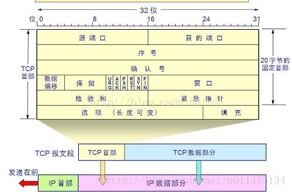

# 计算机网络

# 网络协议分层

# 传输层协议TCP/UDP

##　概念

**用户数据报协议 UDP（User Datagram Protocol）**

是无连接的，尽最大可能交付，没有拥塞控制，面向报文（对于应用程序传下来的报文不合并也不拆分，只是添加 UDP 首部），支持一对一、一对多、多对一和多对多的交互通信。

**传输控制协议 TCP（Transmission Control Protocol）**

是面向连接的，提供可靠交付，有流量控制，拥塞控制，提供全双工通信，面向字节流（把应用层传下来的报文看成字节流，把字节流组织成大小不等的数据块），每一条 TCP 连接只能是点对点的（一对一）。

## 首部格式

UDP 首部字段只有 8 个字节，包括源端口、目的端口、长度、检验和。

TCP 首部格式比 UDP 复杂。

序号：用于对字节流进行编号，例如序号为 301，表示第一个字节的编号为 301，如果携带的数据长度为 100 字节，那么下一个报文段的序号应为 401。

确认号：期望收到的下一个报文段的序号。例如 B 正确收到 A 发送来的一个报文段，序号为 501，携带的数据长度为 200 字节，因此 B 期望下一个报文段的序号为 701，B 发送给 A 的确认报文段中确认号就为 701。

数据偏移：指的是数据部分距离报文段起始处的偏移量，实际上指的是首部的长度。

控制位：八位从左到右分别是 CWR，ECE，URG，ACK，PSH，RST，SYN，FIN。

CWR：CWR 标志与后面的 ECE 标志都用于 IP 首部的 ECN 字段，ECE 标志为 1 时，则通知对方已将拥塞窗口缩小；

ECE：若其值为 1 则会通知对方，从对方到这边的网络有阻塞。在收到数据包的 IP 首部中 ECN 为 1 时将 TCP 首部中的 ECE 设为 1；

URG：该位设为 1，表示包中有需要紧急处理的数据，对于需要紧急处理的数据，与后面的紧急指针有关；

ACK：该位设为 1，确认应答的字段有效，TCP规定除了最初建立连接时的 SYN 包之外该位必须设为 1；

PSH：该位设为 1，表示需要将收到的数据立刻传给上层应用协议，若设为 0，则先将数据进行缓存；

RST：该位设为 1，表示 TCP 连接出现异常必须强制断开连接；

SYN：用于建立连接，该位设为 1，表示希望建立连接，并在其序列号的字段进行序列号初值设定；

FIN：该位设为 1，表示今后不再有数据发送，希望断开连接。当通信结束希望断开连接时，通信双方的主机之间就可以相互交换 FIN 位置为 1 的 TCP 段。

每个主机又对对方的 FIN 包进行确认应答之后可以断开连接。不过，主机收到 FIN 设置为 1 的 TCP 段之后不必马上回复一个 FIN 包，而是可以等到缓冲区中的所有数据都因为已成功发送而被自动删除之后再发 FIN 包；

窗口：窗口值作为接收方让发送方设置其发送窗口的依据。之所以要有这个限制，是因为接收方的数据缓存空间是有限的。

## TCP

### TCP三次握手和四次挥手

TCP 是一种面向连接的单播协议，在发送数据前，通信双方必须在彼此间建立一条连接。所谓的“连接”，其实是客户端和服务器的内存里保存的一份关于对方的信息，如 IP 地址、端口号等。

TCP 可以看成是一种字节流，它会处理 IP 层或以下的层的丢包、重复以及错误问题。在连接的建立过程中，双方需要交换一些连接的参数。这些参数可以放在 TCP 头部。

TCP 提供了一种可靠、面向连接、字节流、传输层的服务，采用三次握手建立一个连接；采用四次挥手来关闭一个连接。

一个 TCP 连接由一个 4 元组构成，分别是两个 IP 地址和两个端口号。一个TCP连接通常分为三个阶段：启动、数据传输、退出（关闭）。

当 TCP 接收到另一端的数据时，它会发送一个确认，但这个确认不会立即发送，一般会延迟一会（提供网络利用率这部分有讲到）。

ACK 是累积的，一个确认字节号 N 的 ACK 表示所有直到 N 的字节（不包括 N）已经成功被接收了。这样的好处是如果一个 ACK 丢失，很可能后续的 ACK 就足以确认前面的报文段了。

一个完整的 TCP 连接是双向和对称的，数据可以在两个方向上平等地流动。给上层应用程序提供一种双工服务。一旦建立了一个连接，这个连接的一个方向上的每个 TCP 报文段都包含了相反方向上的报文段的一个 ACK。

序列号的作用是使得一个 TCP 接收端可丢弃重复的报文段，记录以杂乱次序到达的报文段。因为 TCP 使用 IP 来传输报文段，而IP 不提供重复消除或者保证次序正确的功能。

另一方面，TCP 是一个字节流协议，绝不会以杂乱的次序给上层程序发送数据。因此 TCP 接收端会被迫先保持大序列号的数据不交给应用程序，直到缺失的小序列号的报文段被填满。

#### 三次握手

假设 A 为客户端，B 为服务器端。

首先 B 处于 LISTEN（监听）状态，等待客户的连接请求。

- A 向 B 发送连接请求报文，SYN=1，ACK=0，选择一个初始的序号 x。

- B 收到连接请求报文，如果同意建立连接，则向 A 发送连接确认报文，SYN=1，ACK=1，确认号为 x+1，同时也选择一个初始的序号 y。

- A 收到 B 的连接确认报文后，还要向 B 发出确认，确认号为 y+1，序号为 x+1。

B 收到 A 的确认后，连接建立。

第三次握手是为了防止失效的连接请求到达服务器，让服务器错误打开连接。

#### 四次挥手

**为什么建立连接是三次握手，而关闭连接却是四次挥手呢？**

建立连接的时候， 服务器在LISTEN状态下，收到建立连接请求的SYN报文后，把ACK和SYN放在一个报文里发送给客户端。
而关闭连接时，服务器收到对方的FIN报文时，仅仅表示对方不再发送数据了但是还能接收数据，而自己也未必全部数据都发送给对方了，所以己方可以立即关闭，也可以发送一些数据给对方后，再发送FIN报文给对方来表示同意现在关闭连接，因此，己方ACK和FIN一般都会分开发送，从而导致多了一次。

**TIME_WAIT**

客户端接收到服务器端的 FIN 报文后进入此状态，此时并不是直接进入 CLOSED 状态，还需要等待一个时间计时器设置的时间 2MSL。这么做有两个理由：

- 确保最后一个确认报文能够到达。如果 B 没收到 A 发送来的确认报文，那么就会重新发送连接释放请求报文，A 等待一段时间就是为了处理这种情况的发生。

- 等待一段时间是为了让本连接持续时间内所产生的所有报文都从网络中消失，使得下一个新的连接不会出现旧的连接请求报文。

**CLOSE_WAIT**

如果服务端有大量的close-wait的连接没有及时关闭，而客户端又不断地发送新的连接请求，这样就会打开的文件描述符数会不断增加。在linux系统中，一个进程最大可以同时打开的文件描述符是有上限的，ulimit命令可以查到。当达到这个上限时，服务端进程将无法新建socket来响应新的请求。

### TCP短连接和长连接的区别

短连接：Client 向 Server 发送消息，Server 回应 Client，然后一次读写就完成了，这时候双方任何一个都可以发起 close 操作，不过一般都是 Client 先发起 close 操作。短连接一般只会在 Client/Server 间传递一次读写操作。

短连接的优点：管理起来比较简单，建立存在的连接都是有用的连接，不需要额外的控制手段。

长连接：Client 与 Server 完成一次读写之后，它们之间的连接并不会主动关闭，后续的读写操作会继续使用这个连接。

在长连接的应用场景下，Client 端一般不会主动关闭它们之间的连接，Client 与 Server 之间的连接如果一直不关闭的话，随着客户端连接越来越多，Server 压力也越来越大，这时候 Server 端需要采取一些策略，如关闭一些长时间没有读写事件发生的连接，这样可以避免一些恶意连接导致 Server 端服务受损；如果条件再允许可以以客户端为颗粒度，限制每个客户端的最大长连接数，从而避免某个客户端连累后端的服务。

### TCP粘包和拆包

**为什么会发生 TCP 粘包、拆包？**

- 要发送的数据大于 TCP 发送缓冲区剩余空间大小，将会发生拆包。

- 待发送数据大于 MSS（最大报文长度），TCP 在传输前将进行拆包。

- 要发送的数据小于 TCP 发送缓冲区的大小，TCP 将多次写入缓冲区的数据一次发送出去，将会发生粘包。

- 接收数据端的应用层没有及时读取接收缓冲区中的数据，将发生粘包。

**粘包、拆包解决办法**

由于 TCP 本身是面向字节流的，无法理解上层的业务数据，所以在底层是无法保证数据包不被拆分和重组的，这个问题只能通过上层的应用协议栈设计来解决，根据业界的主流协议的解决方案，归纳如下：

- 消息定长：发送端将每个数据包封装为固定长度（不够的可以通过补 0 填充），这样接收端每次接收缓冲区中读取固定长度的数据就自然而然的把每个数据包拆分开来。

- 设置消息边界：服务端从网络流中按消息边界分离出消息内容。在包尾增加回车换行符进行分割，例如 FTP 协议。

- 将消息分为消息头和消息体：消息头中包含表示消息总长度（或者消息体长度）的字段。

- 更复杂的应用层协议比如 Netty 中实现的一些协议都对粘包、拆包做了很好的处理。

### TCP可靠传输

- 停止等待协议

- 连续ARQ协议

### TCP滑动窗口

窗口是缓存的一部分，用来暂时存放字节流。发送方和接收方各有一个窗口，接收方通过 TCP 报文段中的窗口字段告诉发送方自己的窗口大小，发送方根据这个值和其它信息设置自己的窗口大小。

发送窗口内的字节都允许被发送，接收窗口内的字节都允许被接收。如果发送窗口左部的字节已经发送并且收到了确认，那么就将发送窗口向右滑动一定距离，直到左部第一个字节不是已发送并且已确认的状态；接收窗口的滑动类似，接收窗口左部字节已经发送确认并交付主机，就向右滑动接收窗口。

接收窗口只会对窗口内最后一个按序到达的字节进行确认，例如接收窗口已经收到的字节为 {31, 34, 35}，其中 {31} 按序到达，而 {34, 35} 就不是，因此只对字节 31 进行确认。发送方得到一个字节的确认之后，就知道这个字节之前的所有字节都已经被接收。

### TCP流量控制

流量控制是为了控制发送方发送速率，保证接收方来得及接收。

接收方发送的确认报文中的窗口字段可以用来控制发送方窗口大小，从而影响发送方的发送速率。将窗口字段设置为 0，则发送方不能发送数据。

实际上，为了避免此问题的产生，发送端主机会时不时的发送一个叫做窗口探测的数据段，此数据段仅包含一个字节来获取最新的窗口大小信息。

### TCP拥塞控制

如果网络出现拥塞，分组将会丢失，此时发送方会继续重传，从而导致网络拥塞程度更高。因此当出现拥塞时，应当控制发送方的速率。这一点和流量控制很像，但是出发点不同。流量控制是为了让接收方能来得及接收，而拥塞控制是为了降低整个网络的拥塞程度。

TCP 主要通过四个算法来进行拥塞控制：

慢开始、拥塞避免、快重传、快恢复。

发送方需要维护一个叫做拥塞窗口（cwnd）的状态变量，注意拥塞窗口与发送方窗口的区别：拥塞窗口只是一个状态变量，实际决定发送方能发送多少数据的是发送方窗口。

为了便于讨论，做如下假设：

- 接收方有足够大的接收缓存，因此不会发生流量控制；

- 虽然 TCP 的窗口基于字节，但是这里设窗口的大小单位为报文段。

**慢开始与拥塞避免**

发送的最初执行慢开始，令 cwnd = 1，发送方只能发送 1 个报文段；当收到确认后，将 cwnd 加倍，因此之后发送方能够发送的报文段数量为：2、4、8 ...

注意到慢开始每个轮次都将 cwnd 加倍，这样会让 cwnd 增长速度非常快，从而使得发送方发送的速度增长速度过快，网络拥塞的可能性也就更高。设置一个慢开始门限 ssthresh，当 cwnd >= ssthresh 时，进入拥塞避免，每个轮次只将 cwnd 加 1。

如果出现了超时，则令 ssthresh = cwnd / 2，然后重新执行慢开始。

**快重传与快恢复**

在接收方，要求每次接收到报文段都应该对最后一个已收到的有序报文段进行确认。例如已经接收到 M1 和 M2，此时收到 M4，应当发送对 M2 的确认。

在发送方，如果收到三个重复确认，那么可以知道下一个报文段丢失，此时执行快重传，立即重传下一个报文段。例如收到三个 M2，则 M3 丢失，立即重传 M3。

在这种情况下，只是丢失个别报文段，而不是网络拥塞。因此执行快恢复，令 ssthresh = cwnd / 2 ，cwnd = ssthresh，注意到此时直接进入拥塞避免。

慢开始和快恢复的快慢指的是 cwnd 的设定值，而不是 cwnd 的增长速率。慢开始 cwnd 设定为 1，而快恢复 cwnd 设定为 ssthresh。

### 提高网络利用率

1. Nagle算法

发送端即使还有应该发送的数据，但如果这部分数据很少的话，则进行延迟发送的一种处理机制。具体来说，就是仅在下列任意一种条件下才能发送数据。如果两个条件都不满足，那么暂时等待一段时间以后再进行数据发送。

- 已发送的数据都已经收到确认应答。

- 可以发送最大段长度的数据时。

2. 延迟确认应答

接收方收到数据之后可以并不立即返回确认应答，而是延迟一段时间的机制。

- 在没有收到 2*最大段长度的数据为止不做确认应答。

- 其他情况下，最大延迟 0.5秒 发送确认应答。

- TCP 文件传输中，大多数是每两个数据段返回一次确认应答。

3. 捎带应答

在一个 TCP 包中既发送数据又发送确认应答的一种机制，由此，网络利用率会提高，计算机的负荷也会减轻，但是这种应答必须等到应用处理完数据并将作为回执的数据返回为止。

