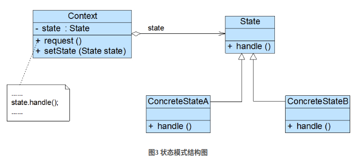
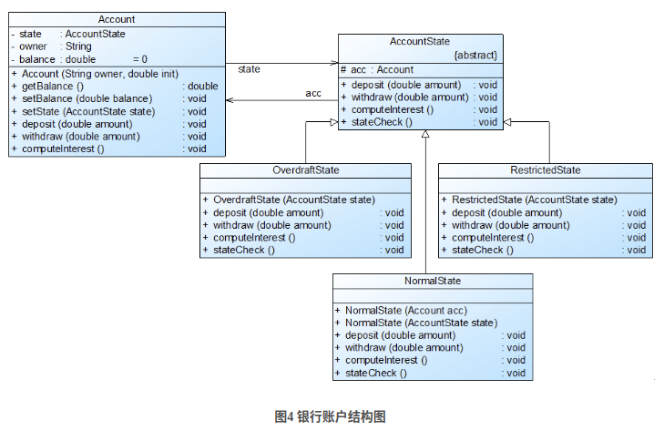

# 状态模式

[参考资料 CSDN](https://blog.csdn.net/lovelion/article/details/8523062)  
状态模式**用于解决系统中复杂对象的状态转换以及不同状态下行为的封装问题**。当系统中某个对象存在多个状态，这些状态之间可以进行转换，而且对象在不同状态下行为不相同时可以使用状态模式。状态模式将一个对象的状态从该对象中分离出来，封装到专门的状态类中，使得对象状态可以灵活变化，对于客户端而言，无须关心对象状态的转换以及对象所处的当前状态，无论对于何种状态的对象，客户端都可以一致处理。

## 定义

状态模式(State Pattern)：允许一个对象在其内部状态改变时改变它的行为，对象看起来似乎修改了它的类。其别名为状态对象(Objects for States)，状态模式是一种对象行为型模式。

## 类图

## 实现

