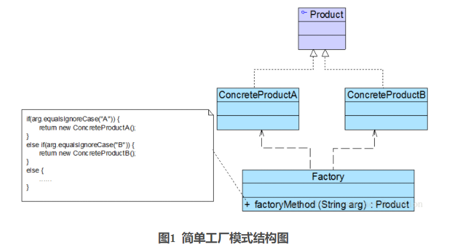
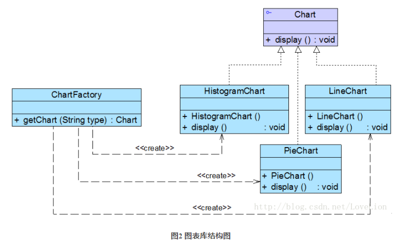
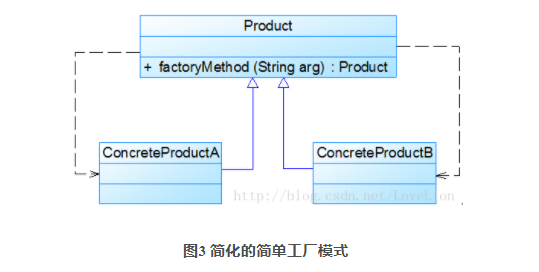

# 简单工厂模式

[参考资料](https://blog.csdn.net/lovelion/article/details/9300337)  

**简单工厂模式(Simple Factory Pattern)** ：定义一个工厂类，它可以根据参数的不同返回不同类的实例，被创建的实例通常都具有共同的父类。因为在简单工厂模式中用于创建实例的方法是静态(static)
方法，因此简单工厂模式又被称为静态工厂方法(Static Factory Method)模式，它属于类创建型模式。

简单工厂模式的要点在于：**当你需要什么，只需要传入一个正确的参数，就可以获取你所需要的对象，而无须知道其创建细节**。简单工厂模式结构比较简单，其核心是工厂类的设计，其结构如图1所示：



在简单工厂模式结构图中包含如下几个角色：

- Factory（工厂角色）  
  工厂角色即工厂类，它是简单工厂模式的核心，负责实现创建所有产品实例的内部逻辑；工厂类可以被外界直接调用，创建所需的产品对象；在工厂类中提供了静态的工厂方法factoryMethod()，它的返回类型为抽象产品类型Product。

- Product（抽象产品角色）  
  它是工厂类所创建的所有对象的父类，封装了各种产品对象的公有方法，它的引入将提高系统的灵活性，使得在工厂类中只需定义一个通用的工厂方法，因为所有创建的具体产品对象都是其子类对象。

- ConcreteProduct（具体产品角色）  
  它是简单工厂模式的创建目标，所有被创建的对象都充当这个角色的某个具体类的实例。每一个具体产品角色都继承了抽象产品角色，需要实现在抽象产品中声明的抽象方法。

在简单工厂模式中，客户端通过工厂类来创建一个产品类的实例，而无须直接使用new关键字来创建对象，它是工厂模式家族中最简单的一员。

在使用简单工厂模式时，首先需要对产品类进行重构，**不能设计一个包罗万象的产品类，而需根据实际情况设计一个产品层次结构**
，将所有产品类公共的代码移至抽象产品类，并在抽象产品类中声明一些抽象方法，以供不同的具体产品类来实现，典型的抽象产品类代码如下所示：

```java
abstract class Product {
    //所有产品类的公共业务方法
    public void methodSame() {
        //公共方法的实现
    }

    //声明抽象业务方法
    public abstract void methodDiff();
}
```

在具体产品类中实现了抽象产品类中声明的抽象业务方法，不同的具体产品类可以提供不同的实现，典型的具体产品类代码如下所示：

```java
class ConcreteProduct extends Product {
    //实现业务方法
    public void methodDiff() {
        //业务方法的实现
    }
}
```

简单工厂模式的核心是工厂类，在没有工厂类之前，客户端一般会使用new关键字来直接创建产品对象，而在引入工厂类之后，客户端可以通过工厂类来创建产品，在简单工厂模式中，工厂类提供了一个静态工厂方法供客户端使用，根据所传入的参数不同可以创建不同的产品对象，典型的工厂类代码如下所示：

```java
class Factory {
    //静态工厂方法
    public static Product getProduct(String arg) {
        Product product = null;
        if (arg.equalsIgnoreCase("A")) {
            product = new ConcreteProductA();
            //初始化设置product
        } else if (arg.equalsIgnoreCase("B")) {
            product = new ConcreteProductB();
            //初始化设置product
        }
        return product;
    }
}
```

在客户端代码中，我们通过调用工厂类的工厂方法即可得到产品对象，典型代码如下所示：

```java
class Client {
    public static void main(String args[]) {
        Product product;
        product = Factory.getProduct("A"); //通过工厂类创建产品对象
        product.methodSame();
        product.methodDiff();
    }
}
```

## 完整解决方案

为了将Chart类的职责分离，同时将Chart对象的创建和使用分离，Sunny软件公司开发人员决定使用简单工厂模式对图表库进行重构，重构后的结构如图2所示：



## 方案的改进

Sunny软件公司开发人员发现在创建具体Chart对象时，每更换一个Chart
对象都需要修改客户端代码中静态工厂方法的参数，客户端代码将要重新编译，这对于客户端而言，违反了“开闭原则”，有没有一种方法能够在不修改客户端代码的前提下更换具体产品对象呢？答案是肯定的，下面将介绍一种常用的实现方式。

我们可以将静态工厂方法的参数存储在XML或properties格式的配置文件中，如下config.xml所示：

```xml
<?xml version="1.0"?>
<config>
    <chartType>histogram</chartType>
</config>
```

再通过一个工具类XMLUtil来读取配置文件中的字符串参数，XMLUtil类的代码如下所示：

```java
public class XMLUtil {
    //该方法用于从XML配置文件中提取图表类型，并返回类型名
    public static String getChartType() {
        try {
            //创建文档对象
            DocumentBuilderFactory dFactory = DocumentBuilderFactory.newInstance();
            DocumentBuilder builder = dFactory.newDocumentBuilder();
            Document doc;
            doc = builder.parse(new File("config.xml"));

            //获取包含图表类型的文本节点
            NodeList nl = doc.getElementsByTagName("chartType");
            Node classNode = nl.item(0).getFirstChild();
            String chartType = classNode.getNodeValue().trim();
            return chartType;
        } catch (Exception e) {
            e.printStackTrace();
            return null;
        }
    }
}
```

在引入了配置文件和工具类XMLUtil之后，客户端代码修改如下：

```java
class Client {
	public static void main(String args[]) {
		Chart chart;
		String type = XMLUtil.getChartType(); //读取配置文件中的参数
		chart = ChartFactory.getChart(type); //创建产品对象
		chart.display();
	}
}
```

不难发现，在上述客户端代码中不包含任何与具体图表对象相关的信息，如果需要更换具体图表对象，只需修改配置文件config.xml，无须修改任何源代码，符合“开闭原则”。

## 简单工厂模式的简化

有时候，为了简化简单工厂模式，我们可以将抽象产品类和工厂类合并，将静态工厂方法移至抽象产品类中，如图3所示：



在图3中，客户端可以通过产品父类的静态工厂方法，根据参数的不同创建不同类型的产品子类对象，这种做法在JDK等类库和框架中也广泛存在。

## 简单工厂模式总结

简单工厂模式提供了专门的工厂类用于创建对象，将对象的创建和对象的使用分离开，它作为一种最简单的工厂模式在软件开发中得到了较为广泛的应用。

### 1.主要优点

简单工厂模式的主要优点如下：

1. 工厂类包含必要的判断逻辑，可以决定在什么时候创建哪一个产品类的实例，客户端可以免除直接创建产品对象的职责，而仅仅“消费”产品，简单工厂模式实现了对象创建和使用的分离。

2. 客户端无须知道所创建的具体产品类的类名，只需要知道具体产品类所对应的参数即可，对于一些复杂的类名，通过简单工厂模式可以在一定程度减少使用者的记忆量。

3. 通过引入配置文件，可以在不修改任何客户端代码的情况下更换和增加新的具体产品类，在一定程度上提高了系统的灵活性。

### 2.主要缺点

简单工厂模式的主要缺点如下：

1. 由于工厂类集中了所有产品的创建逻辑，职责过重，一旦不能正常工作，整个系统都要受到影响。

2. 使用简单工厂模式势必会增加系统中类的个数（引入了新的工厂类），增加了系统的复杂度和理解难度。

3. 系统扩展困难，一旦添加新产品就不得不修改工厂逻辑，在产品类型较多时，有可能造成工厂逻辑过于复杂，不利于系统的扩展和维护。

4. 简单工厂模式由于使用了静态工厂方法，造成工厂角色无法形成基于继承的等级结构。

### 适用场景

在以下情况下可以考虑使用简单工厂模式：

1. 工厂类负责创建的对象比较少，由于创建的对象较少，不会造成工厂方法中的业务逻辑太过复杂。

2. 客户端只知道传入工厂类的参数，对于如何创建对象并不关心。