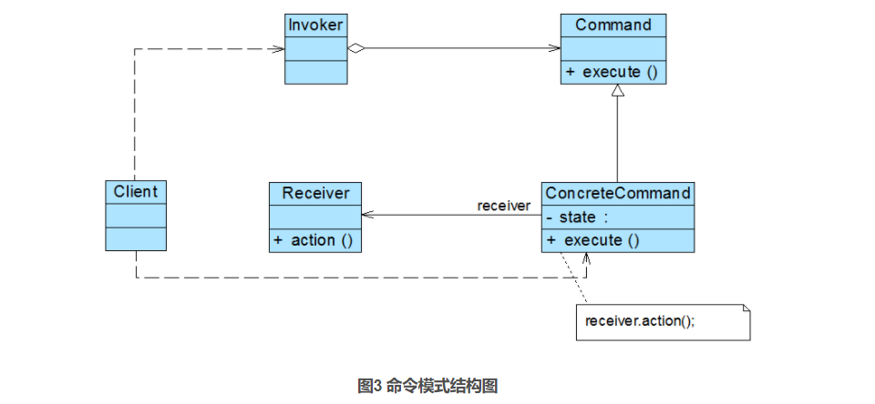
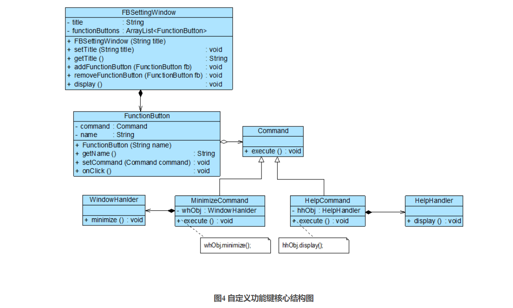
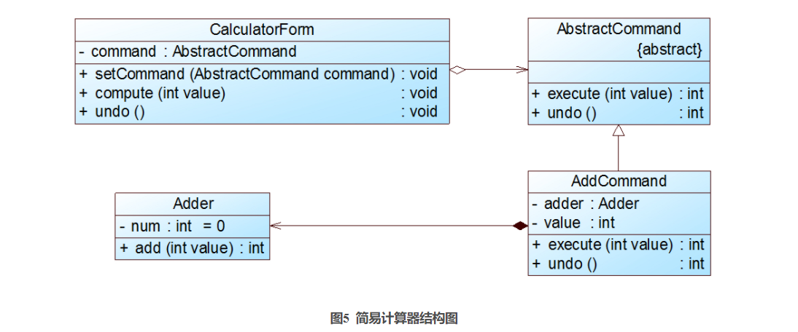
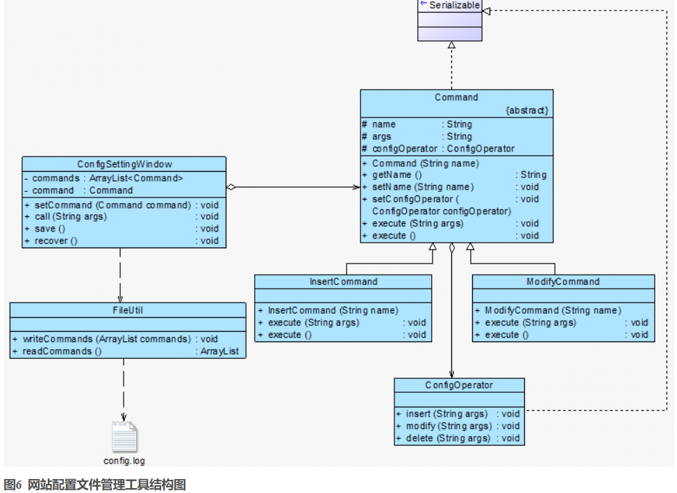
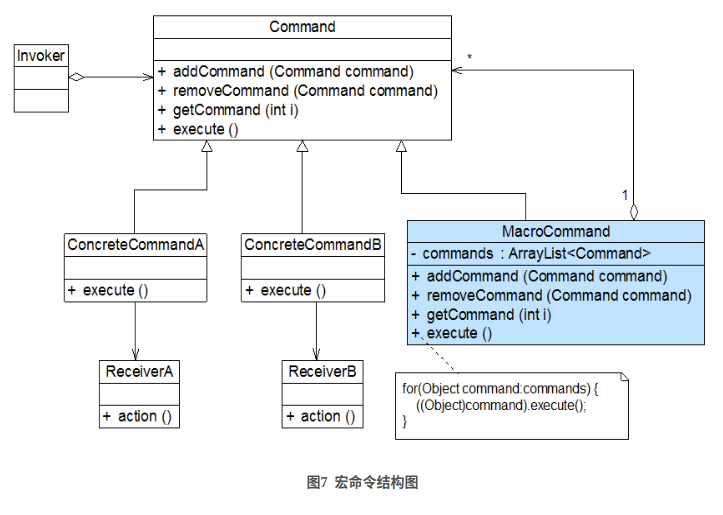

# 命令模式概述

在软件开发中，我们经常需要向某些对象发送请求（调用其中的某个或某些方法），但是并不知道请求的接受者是谁，也不知道被请求的操作是哪个，此时，我们特别希望能够以一种松耦合的方式来设计软件，
使得请求发送者与请求接受者能够消除彼此之间的耦合，让对象之间的调用关系更加灵活，可以灵活地指定请求接收者以及被请求的操作。命令模式为此类问题提供了一个较为完美的解决方案。  

命令模式可以将请求发送者和接收者完全解耦，发送者与接收者之间没有直接引用关系，发送请求的对象只需要知道如何发送请求，而不必知道如何完成请求。  

命令模式定义如下：  

**命令模式（Command Pattern）：将一个请求封装为一个对象，从而让我们可用不同的请求对客户进行参数化；对请求排队或者记录请求日志，以及支持可撤销的操作。命令模式是一种对象行为型模式，其别名为动作（Action）模式或事务（Transaction）模式。**

# 命令模式结构

命令模式的核心在于引入了命令类，通过命令类来降低发送者和接收者的耦合度，请求发送者只需指定一个命令对象，再通过命令对象来调用请求接收者的处理方法，其结构如图3所示：



在命令模式结构图中包含如下几个角色：

- Command(抽象命令类)：抽象命令类一般是一个抽象类或接口，在其中声明了用于执行请求的execute()等方法，通过这些方法可以调用请求接收者的相关操作。

- ConcreteCommand(具体命令类)：具体命令类是抽象命令类的子类，实现了在抽象命令类中声明的方法，它对应具体的接收者对象，将接收者对象的动作绑定其中。在实现execute()方法时，将调用接收者对象的相关操作(Action)。

- Invoker(调用者)：调用者即请求发送者，它通过命令对象来执行请求。一个调用者并不需要在设计时确定其接收者，因此它只与抽象命令类之间存在关联关系。在程序运行时可以将一个具体命令对象注入其中，再调用具体命令对象的execute()方法，从而实现间接调用请求接收者的相关操作。

- Receiver(接收者)：接收者执行与请求相关的操作，它具体实现对请求的业务处理。

# 典型代码

命令模式的本质是对请求进行封装，一个请求对应于一个命令，将发出命令的责任和执行命令的责任分割开。每一个命令都是一个操作：请求的一方发出请求要求执行一个操作；
接收的一方收到请求，并执行相应的操作。命令模式允许请求的一方和接收的一方独立开来，使得请求的一方不必知道接收请求的一方的接口，更不必知道请求如何被接收、操作是否被执行、何时被执行，以及是怎么被执行的。  

命令模式的关键在于引入了抽象命令类，请求发送者针对抽象命令类编程，只有实现了抽象命令类的具体命令才与请求接收者相关联。
在最简单的抽象命令类中只包含了一个抽象的execute()方法，每个具体命令类将一个Receiver类型的对象作为一个实例变量进行存储，从而具体指定一个请求的接收者，不同的具体命令类提供了execute()方法的不同实现，并调用不同接收者的请求处理方法。  

典型的抽象命令类代码如下所示：

```java
abstract class Command {
	public abstract void execute();
}
```

对于请求发送者即调用者而言，将针对抽象命令类进行编程，可以通过构造注入或者设值注入的方式在运行时传入具体命令类对象，并在业务方法中调用命令对象的execute()方法，其典型代码如下所示：

```java
class Invoker {
	private Command command;
	
    //构造注入
	public Invoker(Command command) {
		this.command = command;
	}
	
    //设值注入
	public void setCommand(Command command) {
		this.command = command;
	}
	
	//业务方法，用于调用命令类的execute()方法
	public void call() {
		command.execute();
	}
}
```

具体命令类继承了抽象命令类，它与请求接收者相关联，实现了在抽象命令类中声明的execute()方法，并在实现时调用接收者的请求响应方法action()，其典型代码如下所示：

```java
class ConcreteCommand extends Command {
	private Receiver receiver; //维持一个对请求接收者对象的引用
 
	public void execute() {
		receiver.action(); //调用请求接收者的业务处理方法action()
	}
}
```

请求接收者Receiver类具体实现对请求的业务处理，它提供了action()方法，用于执行与请求相关的操作，其典型代码如下所示：

```java
class Receiver {
	public void action() {
		//具体操作
	}
}
```

# 完整解决方案

为了降低功能键与功能处理类之间的耦合度，让用户可以自定义每一个功能键的功能，Sunny软件公司开发人员使用命令模式来设计“自定义功能键”模块，其核心结构如图4所示：



在图4中，FBSettingWindow是“功能键设置”界面类，FunctionButton充当请求调用者，Command充当抽象命令类，MinimizeCommand和HelpCommand充当具体命令类，WindowHanlder和HelpHandler充当请求接收者。

具体代码见`src/main/java/_设计模式/_行为型/_命令模式`  

如果需要修改功能键的功能，例如某个功能键可以实现“自动截屏”，只需要对应增加一个新的具体命令类，在该命令类与屏幕处理者(ScreenHandler)之间创建一个关联关系，然后将该具体命令类的对象通过配置文件注入到某个功能键即可，原有代码无须修改，符合“开闭原则”。在此过程中，**每一个具体命令类对应一个请求的处理者（接收者），通过向请求发送者注入不同的具体命令对象可以使得相同的发送者对应不同的接收者，从而实现“将一个请求封装为一个对象，用不同的请求对客户进行参数化”**，客户端只需要将具体命令对象作为参数注入请求发送者，无须直接操作请求的接收者。

# 命令队列的实现

有时候我们需要将多个请求排队，当一个请求发送者发送一个请求时，将不止一个请求接收者产生响应，这些请求接收者将逐个执行业务方法，完成对请求的处理。此时，我们可以通过命令队列来实现。  

命令队列的实现方法有多种形式，其中最常用、灵活性最好的一种方式是增加一个CommandQueue类，由该类来负责存储多个命令对象，而不同的命令对象可以对应不同的请求接收者，CommandQueue类的典型代码如下所示：

```java
import java.util.*;
 
class CommandQueue {
    //定义一个ArrayList来存储命令队列
	private ArrayList<Command> commands = new ArrayList<Command>();
	
	public void addCommand(Command command) {
		commands.add(command);
	}
	
	public void removeCommand(Command command) {
		commands.remove(command);
	}
	
    //循环调用每一个命令对象的execute()方法
	public void execute() {
		for (Object command : commands) {
			((Command)command).execute();
		}
	}
}
```

在增加了命令队列类CommandQueue以后，请求发送者类Invoker将针对CommandQueue编程，代码修改如下：

```java
class Invoker {
	private CommandQueue commandQueue; //维持一个CommandQueue对象的引用
	
    //构造注入
	public Invoker(CommandQueue commandQueue) {
		this. commandQueue = commandQueue;
	}
	
    //设值注入
	public void setCommandQueue(CommandQueue commandQueue) {
		this.commandQueue = commandQueue;
	}
	
	//调用CommandQueue类的execute()方法
	public void call() {
		commandQueue.execute();
	}
}
```

命令队列与我们常说的“批处理”有点类似。批处理，顾名思义，可以对一组对象（命令）进行批量处理，当一个发送者发送请求后，将有一系列接收者对请求作出响应，命令队列可以用于设计批处理应用程序，如果请求接收者的接收次序没有严格的先后次序，我们还可以使用多线程技术来并发调用命令对象的execute()方法，从而提高程序的执行效率。

# 撤销操作的实现

在命令模式中，我们可以通过调用一个命令对象的execute()方法来实现对请求的处理，如果需要撤销(Undo)请求，可通过在命令类中增加一个逆向操作来实现。  

下面通过一个简单的实例来学习如何使用命令模式实现撤销操作：  

Sunny软件公司欲开发一个简易计算器，该计算器可以实现简单的数学运算，还可以对运算实施撤销操作。  

Sunny软件公司开发人员使用命令模式设计了如图5所示结构图，其中计算器界面类CalculatorForm充当请求发送者，实现了数据求和功能的加法类Adder充当请求接收者，界面类可间接调用加法类中的add()方法实现加法运算，并且提供了可撤销加法运算的undo()方法。



本实例完整代码如下所示：

```java
//加法类：请求接收者
class Adder {
	private int num=0; //定义初始值为0
	
    //加法操作，每次将传入的值与num作加法运算，再将结果返回
	public int add(int value) {
		num += value;
		return num;
	}
}
 
//抽象命令类
abstract class AbstractCommand {
	public abstract int execute(int value); //声明命令执行方法execute()
	public abstract int undo(); //声明撤销方法undo()
}
 
//具体命令类
class ConcreteCommand extends AbstractCommand {
	private Adder adder = new Adder();
	private int value;
		
	//实现抽象命令类中声明的execute()方法，调用加法类的加法操作
public int execute(int value) {
		this.value=value;
		return adder.add(value);
	}
	
    //实现抽象命令类中声明的undo()方法，通过加一个相反数来实现加法的逆向操作
	public int undo() {
		return adder.add(-value);
	}
}
 
//计算器界面类：请求发送者
class CalculatorForm {
	private AbstractCommand command;
	
	public void setCommand(AbstractCommand command) {
		this.command = command;
	}
	
    //调用命令对象的execute()方法执行运算
	public void compute(int value) {
		int i = command.execute(value);
		System.out.println("执行运算，运算结果为：" + i);
	}
	
    //调用命令对象的undo()方法执行撤销
	public void undo() {
		int i = command.undo();
		System.out.println("执行撤销，运算结果为：" + i);
	}
}
```

编写如下客户端测试代码：

```java
class Client {
	public static void main(String args[]) {
		CalculatorForm form = new CalculatorForm();
		AbstractCommand command;
		command = new ConcreteCommand();
		form.setCommand(command); //向发送者注入命令对象
		
		form.compute(10);
		form.compute(5);
		form.compute(10);
		form.undo();
	}
}
```

编译并运行程序，输出结果如下：  

```
执行运算，运算结果为：10

执行运算，运算结果为：15

执行运算，运算结果为：25

执行撤销，运算结果为：15
```

需要注意的是在本实例中只能实现一步撤销操作，因为没有保存命令对象的历史状态，可以通过引入一个命令集合或其他方式来存储每一次操作时命令的状态，从而实现多次撤销操作。除了Undo操作外，还可以采用类似的方式实现恢复(Redo)操作，即恢复所撤销的操作（或称为二次撤销）。

# 请求日志

请求日志就是将请求的历史记录保存下来，通常以日志文件(Log File)的形式永久存储在计算机中。很多系统都提供了日志文件，例如Windows日志文件、Oracle日志文件等，日志文件可以记录用户对系统的一些操作（例如对数据的更改）。请求日志文件可以实现很多功能，常用功能如下：

1. “天有不测风云”，一旦系统发生故障，日志文件可以为系统提供一种恢复机制，在请求日志文件中可以记录用户对系统的每一步操作，从而让系统能够顺利恢复到某一个特定的状态；

2. 请求日志也可以用于实现批处理，在一个请求日志文件中可以存储一系列命令对象，例如一个命令队列；

3. 可以将命令队列中的所有命令对象都存储在一个日志文件中，每执行一个命令则从日志文件中删除一个对应的命令对象，防止因为断电或者系统重启等原因造成请求丢失，而且可以避免重新发送全部请求时造成某些命令的重复执行，只需读取请求日志文件，再继续执行文件中剩余的命令即可。

3. 在实现请求日志时，我们可以将命令对象通过序列化写到日志文件中，此时命令类必须实现java.io.Serializable接口。下面我们通过一个简单实例来说明日志文件的用途以及如何实现请求日志：  

Sunny软件公司开发了一个网站配置文件管理工具，可以通过一个可视化界面对网站配置文件进行增删改等操作，该工具使用命令模式进行设计，结构如图6所示：



现在Sunny软件公司开发人员希望将对配置文件的操作请求记录在日志文件中，如果网站重新部署，只需要执行保存在日志文件中的命令对象即可修改配置文件。  

本例完整代码见`src/main/java/_设计模式/_行为型/_命令模式/_请求日志`

# 宏命令

宏命令(Macro Command)又称为组合命令，它是组合模式和命令模式联用的产物。宏命令是一个具体命令类，它拥有一个集合属性，在该集合中包含了对其他命令对象的引用。通常宏命令不直接与请求接收者交互，而是通过它的成员来调用接收者的方法。当调用宏命令的execute()方法时，将递归调用它所包含的每个成员命令的execute()方法，一个宏命令的成员可以是简单命令，还可以继续是宏命令。执行一个宏命令将触发多个具体命令的执行，从而实现对命令的批处理，其结构如图7所示：



# 命令模式总结

命令模式是一种使用频率非常高的设计模式，它可以将请求发送者与接收者解耦，请求发送者通过命令对象来间接引用请求接收者，使得系统具有更好的灵活性和可扩展性。在基于GUI的软件开发，无论是在电脑桌面应用还是在移动应用中，命令模式都得到了广泛的应用。

## 主要优点

命令模式的主要优点如下：

1. **降低系统的耦合度**。由于请求者与接收者之间不存在直接引用，因此请求者与接收者之间实现完全解耦，相同的请求者可以对应不同的接收者，同样，相同的接收者也可以供不同的请求者使用，两者之间具有良好的独立性。

2. **新的命令可以很容易地加入到系统中**。由于增加新的具体命令类不会影响到其他类，因此增加新的具体命令类很容易，无须修改原有系统源代码，甚至客户类代码，满足“开闭原则”的要求。

3. **可以比较容易地设计一个命令队列或宏命令（组合命令）**。

4. **为请求的撤销(Undo)和恢复(Redo)操作提供了一种设计和实现方案**。

## 主要缺点

命令模式的主要缺点如下：  

使用命令模式可能会导致某些系统有过多的具体命令类。因为针对每一个对请求接收者的调用操作都需要设计一个具体命令类，因此在某些系统中可能需要提供大量的具体命令类，这将影响命令模式的使用。

## 适用场景

在以下情况下可以考虑使用命令模式：

1. 系统需要将请求调用者和请求接收者解耦，使得调用者和接收者不直接交互。请求调用者无须知道接收者的存在，也无须知道接收者是谁，接收者也无须关心何时被调用。

2. 系统需要在不同的时间指定请求、将请求排队和执行请求。一个命令对象和请求的初始调用者可以有不同的生命期，换言之，最初的请求发出者可能已经不在了，而命令对象本身仍然是活动的，可以通过该命令对象去调用请求接收者，而无须关心请求调用者的存在性，可以通过请求日志文件等机制来具体实现。

3. 系统需要支持命令的撤销(Undo)操作和恢复(Redo)操作。

4. 系统需要将一组操作组合在一起形成宏命令。