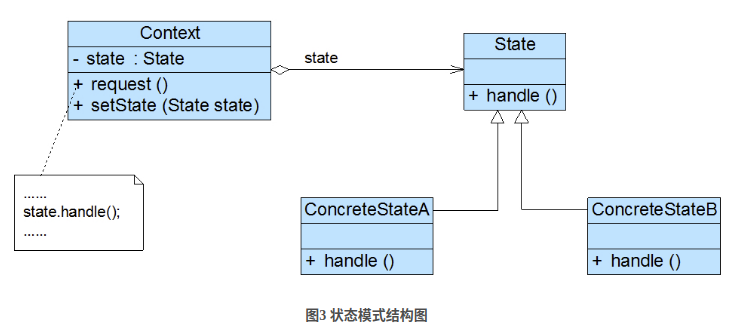
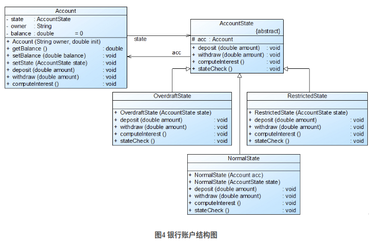
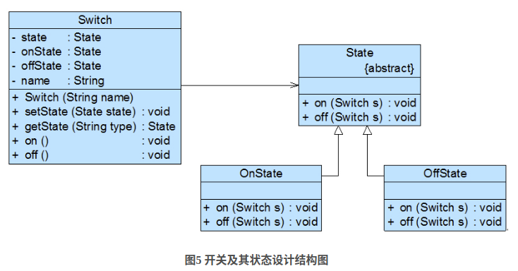
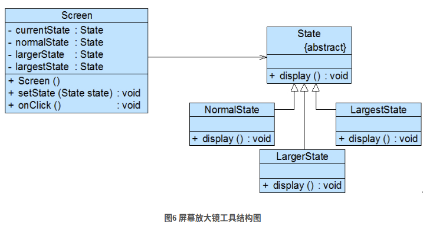

# 状态模式

[参考资料](https://blog.csdn.net/lovelion/article/details/8523062)  

状态模式**用于解决系统中复杂对象的状态转换以及不同状态下行为的封装问题**
。当系统中某个对象存在多个状态，这些状态之间可以进行转换，而且对象在不同状态下行为不相同时可以使用状态模式。状态模式将一个对象的状态从该对象中分离出来，封装到专门的状态类中，使得对象状态可以灵活变化，对于客户端而言，无须关心对象状态的转换以及对象所处的当前状态，无论对于何种状态的对象，客户端都可以一致处理。

## 定义

状态模式(State Pattern)：允许一个对象在其内部状态改变时改变它的行为，对象看起来似乎修改了它的类。其别名为状态对象(Objects for States)，状态模式是一种对象行为型模式。

## 类图

在状态模式中引入了抽象状态类和具体状态类，它们是状态模式的核心，其结构如图3所示：



在状态模式结构图中包含如下几个角色：

- **Context（环境类）：**
  环境类又称为上下文类，它是拥有多种状态的对象。由于环境类的状态存在多样性且在不同状态下对象的行为有所不同，因此将状态独立出去形成单独的状态类。在环境类中维护一个抽象状态类State的实例，这个实例定义当前状态，在具体实现时，它是一个State子类的对象。

- **State（抽象状态类）：**
  它用于定义一个接口以封装与环境类的一个特定状态相关的行为，在抽象状态类中声明了各种不同状态对应的方法，而在其子类中实现类这些方法，由于不同状态下对象的行为可能不同，因此在不同子类中方法的实现可能存在不同，相同的方法可以写在抽象状态类中。 
  
- **ConcreteState（具体状态类）：**
  它是抽象状态类的子类，每一个子类实现一个与环境类的一个状态相关的行为，每一个具体状态类对应环境的一个具体状态，不同的具体状态类其行为有所不同。

## 实现

### State（抽象状态类）

在状态模式中，我们将对象在不同状态下的行为封装到不同的状态类中，为了让系统具有更好的灵活性和可扩展性，同时对各状态下的共有行为进行封装，我们需要对状态进行抽象，引入了抽象状态类角色，其典型代码如下所示：

```java
abstract class State {
    //声明抽象业务方法，不同的具体状态类可以不同的实现
	public abstract void handle();
}
```

### ConcreteState（具体状态类）

在抽象状态类的子类即具体状态类中实现了在抽象状态类中声明的业务方法，不同的具体状态类可以提供完全不同的方法实现，在实际使用时，在一个状态类中可能包含多个业务方法，如果在具体状态类中某些业务方法的实现完全相同，可以将这些方法移至抽象状态类，实现代码的复用，典型的具体状态类代码如下所示：

```java
class ConcreteState extends State {
	public void handle() {
		//方法具体实现代码
	}
}
```

### Context（环境类）

环境类维持一个对抽象状态类的引用，通过setState()方法可以向环境类注入不同的状态对象，再在环境类的业务方法中调用状态对象的方法，典型代码如下所示：

```java
class Context {
	private State state; //维持一个对抽象状态对象的引用
	private int value; //其他属性值，该属性值的变化可能会导致对象状态发生变化
 
    //设置状态对象
	public void setState(State state) {
		this.state = state;
	}
 
	public void request() {
		//其他代码
		state.handle(); //调用状态对象的业务方法
		//其他代码
	}
}
```

环境类实际上是真正拥有状态的对象，我们只是将环境类中与状态有关的代码提取出来封装到专门的状态类中。在状态模式结构图中，环境类Context与抽象状态类State之间存在单向关联关系，在Context中定义了一个State对象。在实际使用时，它们之间可能存在更为复杂的关系，State与Context之间可能也存在依赖或者关联关系。  

## 状态转换

在状态模式的使用过程中，一个对象的状态之间还可以进行相互转换，通常有两种实现状态转换的方式：

### (1)统一由环境类来负责状态之间的转换

此时，环境类还充当了状态管理器(State Manager)角色，在环境类的业务方法中通过对某些属性值的判断实现状态转换，还可以提供一个专门的方法用于实现属性判断和状态转换，如下代码片段所示：

```java
    ……
      public void changeState() {
		//判断属性值，根据属性值进行状态转换
      if (value == 0) {
			this.setState(new ConcreteStateA());
		}
		else if (value == 1) {
			this.setState(new ConcreteStateB());
		}
        ......
	}
    ……

```

### (2)由具体状态类来负责状态之间的转换

可以在具体状态类的业务方法中判断环境类的某些属性值再根据情况为环境类设置新的状态对象，实现状态转换，同样，也可以提供一个专门的方法来负责属性值的判断和状态转换。此时，状态类与环境类之间就将存在依赖或关联关系，因为状态类需要访问环境类中的属性值，如下代码片段所示：

```java
	……
      public void changeState(Context ctx) {
		//根据环境对象中的属性值进行状态转换
      if (ctx.getValue() == 1) {
			ctx.setState(new ConcreteStateB());
		}
		else if (ctx.getValue() == 2) {
			ctx.setState(new ConcreteStateC());
		}
        ......
	}
    ……
```

## 完整解决方案

Sunny软件公司开发人员使用状态模式来解决账户状态的转换问题，客户端只需要执行简单的存款和取款操作，系统根据余额将自动转换到相应的状态，其基本结构如图4所示：



在图4中，Account充当环境类角色，AccountState充当抽象状态角色，NormalState、OverdraftState和RestrictedState充当具体状态角色。

## 共享状态

在有些情况下，多个环境对象可能需要共享同一个状态，如果希望在系统中实现多个环境对象共享一个或多个状态对象，那么需要**将这些状态对象定义为环境类的静态成员对象**。  

下面通过一个简单实例来说明如何实现共享状态：  

```text
如果某系统要求两个开关对象要么都处于开的状态，要么都处于关的状态，在使用时它们的状态必须保持一致，开关可以由开转换到关，也可以由关转换到开。  
```

可以使用状态模式来实现开关的设计，其结构如图5所示：



## 使用环境类实现状态转换

在状态模式中实现状态转换时，**具体状态类可通过调用环境类Context的setState()方法进行状态的转换操作，也可以统一由环境类Context来实现状态的转换**。此时，增加新的具体状态类可能需要修改其他具体状态类或者环境类的源代码，否则系统无法转换到新增状态。但是对于客户端来说，无须关心状态类，可以为环境类设置默认的状态类，而将状态的转换工作交给具体状态类或环境类来完成，具体的转换细节对于客户端而言是透明的。  

在上面的“银行账户状态转换”实例中，我们通过具体状态类来实现状态的转换，在每一个具体状态类中都包含一个stateCheck()方法，在该方法内部实现状态的转换，除此之外，我们还可以通过环境类来实现状态转换，**环境类作为一个状态管理器，统一实现各种状态之间的转换操作**。  

下面通过一个包含循环状态的简单实例来说明如何使用环境类实现状态转换：  

```text
Sunny软件公司某开发人员欲开发一个屏幕放大镜工具，其具体功能描述如下：
用户单击“放大镜”按钮之后屏幕将放大一倍，再点击一次“放大镜”按钮屏幕再放大一倍，第三次点击该按钮后屏幕将还原到默认大小。
```

可以考虑使用状态模式来设计该屏幕放大镜工具，我们定义三个屏幕状态类NormalState、LargerState和LargestState来对应屏幕的三种状态，分别是正常状态、二倍放大状态和四倍放大状态，屏幕类Screen充当环境类，其结构如图6所示：




## 状态模式总结

状态模式将一个对象在不同状态下的不同行为封装在一个个状态类中，通过设置不同的状态对象可以让环境对象拥有不同的行为，而状态转换的细节对于客户端而言是透明的，方便了客户端的使用。在实际开发中，状态模式具有较高的使用频率，在工作流和游戏开发中状态模式都得到了广泛的应用，例如公文状态的转换、游戏中角色的升级等。

### 主要优点

状态模式的主要优点如下：

1. **封装了状态的转换规则**，在状态模式中可以将状态的转换代码封装在环境类或者具体状态类中，可以对状态转换代码进行集中管理，而不是分散在一个个业务方法中。

2. **将所有与某个状态有关的行为放到一个类中**，只需要注入一个不同的状态对象即可使环境对象拥有不同的行为。

3. **允许状态转换逻辑与状态对象合成一体，而不是提供一个巨大的条件语句块**，状态模式可以让我们避免使用庞大的条件语句来将业务方法和状态转换代码交织在一起。

4. 可以**让多个环境对象共享一个状态对象**，从而减少系统中对象的个数。

### 主要缺点

状态模式的主要缺点如下：

1. 状态模式的使用**必然会增加系统中类和对象的个数，导致系统运行开销增大**。

2. 状态模式的结构与实现都较为复杂，**如果使用不当将导致程序结构和代码的混乱，增加系统设计的难度**。

3. 状态模式**对“开闭原则”的支持并不太好**，增加新的状态类需要修改那些负责状态转换的源代码，否则无法转换到新增状态；而且修改某个状态类的行为也需修改对应类的源代码。

### 使用场景

在以下情况下可以考虑使用状态模式：

1. 对象的行为依赖于它的状态（如某些属性值），状态的改变将导致行为的变化。

2. 在代码中包含大量与对象状态有关的条件语句，这些条件语句的出现，会导致代码的可维护性和灵活性变差，不能方便地增加和删除状态，并且导致客户类与类库之间的耦合增强。