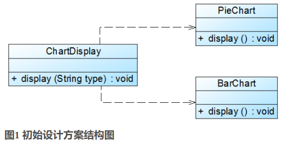
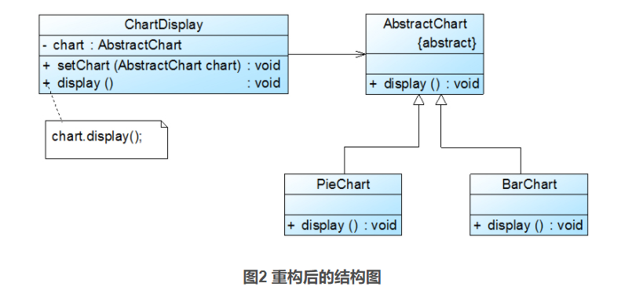

# 开闭原则

[参考资料](https://blog.csdn.net/lovelion/article/details/7537584)  

**开闭原则(Open-Closed Principle, OCP)：一个软件实体应当对扩展开放，对修改关闭。即软件实体应尽量在不修改原有代码的情况下进行扩展。**  

在开闭原则的定义中，**软件实体可以指一个软件模块、一个由多个类组成的局部结构或一个独立的类**。  

为了满足开闭原则，需要对系统进行抽象化设计，**抽象化是开闭原则的关键**。在Java、C#等编程语言中，可以为系统定义一个相对稳定的抽象层，而将不同的实现行为移至具体的实现层中完成。在很多面向对象编程语言中都提供了接口、抽象类等机制，可以通过它们定义系统的抽象层，再通过具体类来进行扩展。如果需要修改系统的行为，无须对抽象层进行任何改动，只需要增加新的具体类来实现新的业务功能即可，实现在不修改已有代码的基础上扩展系统的功能，达到开闭原则的要求。

## 案例

Sunny软件公司开发的CRM系统可以显示各种类型的图表，如饼状图和柱状图等，为了支持多种图表显示方式，原始设计方案如图1所示：



在ChartDisplay类的display()方法中存在如下代码片段：

```java
......
if (type.equals("pie")) {
PieChart chart = new PieChart();
chart.display();
}
else if (type.equals("bar")) {
BarChart chart = new BarChart();
chart.display();
}
......
```

在该代码中，如果需要增加一个新的图表类，如折线图LineChart，则需要修改ChartDisplay类的display()方法的源代码，增加新的判断逻辑，违反了开闭原则。  

现对该系统进行重构，使之符合开闭原则。  

在本实例中，由于在ChartDisplay类的display()方法中针对每一个图表类编程，因此增加新的图表类不得不修改源代码。可以通过抽象化的方式对系统进行重构，使之增加新的图表类时无须修改源代码，满足开闭原则。具体做法如下：  

1. 增加一个抽象图表类AbstractChart，将各种具体图表类作为其子类；

2. ChartDisplay类针对抽象图表类进行编程，由客户端来决定使用哪种具体图表。

重构后结构如图2所示：



在图2中，我们引入了抽象图表类AbstractChart，且ChartDisplay针对抽象图表类进行编程，并通过setChart()方法由客户端来设置实例化的具体图表对象，在ChartDisplay的display()方法中调用chart对象的display()方法显示图表。如果需要增加一种新的图表，如折线图LineChart，只需要将LineChart也作为AbstractChart的子类，在客户端向ChartDisplay中注入一个LineChart对象即可，无须修改现有类库的源代码。    
